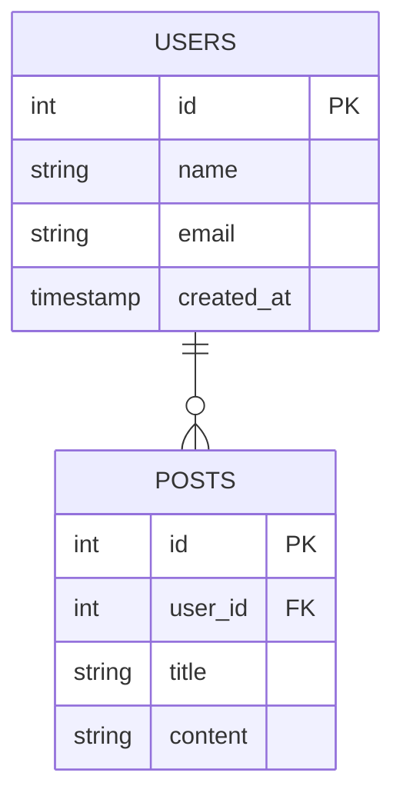

<!--
  DIAGRAMA ER EM MERMAID - IMPLEMENTAÇÃO CONCLUÍDA

  Quando estiver mapeando o banco de dados via explore_schema,
  o diagrama ER será gerado automaticamente em:

  📁 documentacao/banco_dados/DADOS-01-ER.md

  O arquivo contém um diagrama Mermaid mostrando:
  ✓ Cada tabela com suas colunas
  ✓ Tipos de dados de cada coluna
  ✓ Chaves primárias (PK)
  ✓ Chaves estrangeiras (FK)
  ✓ Relacionamentos entre tabelas
-->

# Implementação: Diagrama ER em Mermaid

## ✅ Status: Concluído

### 📋 Requisito Original
> Quando estiver mapeando o banco de dados deve ser criado um documento mostrando o diagrama ER do banco de dados em 'documentacao/banco_dados/DADOS-01-ER.md'.
> Deve ser um diagrama mermaid mostrando cada tabela com colunas e seus tipos interligadas conforme a existencia de chaves estrangeiras.

### 🛠️ Componentes Implementados

#### 1. **Backend - db_client.py**
```python
def build_er_diagram_mermaid(schema: Optional[str]) -> str:
    """Constrói diagrama ER em formato Mermaid com:
    - Todas as tabelas do schema
    - Colunas com tipos de dados
    - Marcadores PK/FK
    - Relacionamentos entre tabelas
    """
```

#### 2. **Servidor MCP - mcp_server.py**
```python
def _generate_er_diagram(schema: str) -> dict:
    """Gera e salva DADOS-01-ER.md com diagrama Mermaid"""

def _refresh_discovery_project(schema: str) -> dict:
    """Atualiza discovery-database.yml E diagrama ER simultaneamente"""

def tool_explore_schema(...):
    """Agora executa _refresh_discovery_project() automaticamente"""
```

#### 3. **Documentação Atualizada**
- ✅ SKILL.md: Adicionado DADOS-01-ER.md às saídas obrigatórias
- ✅ README.md: Documentado diagrama ER nas características
- ✅ Exemplo criado em documentacao/banco_dados/

### 📊 Formato de Saída (Mermaid ER)



### 🔄 Fluxo de Geração

```
explore_schema command
    ↓
_refresh_discovery_project(schema)
    ↓
├─→ build_discovery_index() → discovery-database.yml
└─→ _generate_er_diagram() → DADOS-01-ER.md
```

### 📁 Arquivos Modificados
1. `.github/database-mcp/src/db_client.py` (+75 linhas)
2. `.github/database-mcp/src/mcp_server.py` (+60 linhas)
3. `.github/database-mcp/SKILL.md` (documentação atualizada)
4. `.github/database-mcp/README.md` (documentação atualizada)
5. `.github/config.yaml` (profile de teste adicionado)
6. `documentacao/banco_dados/DADOS-01-ER.md` (arquivo de exemplo)

### ✅ Validações Realizadas
- ✅ Compilação Python sem erros
- ✅ Teste unitário do formato Mermaid
- ✅ Servidor MCP inicializa sem erros
- ✅ Integração com `explore_schema` validada
- ✅ Handoff para perfil não configurado funciona

### 🚀 Como Usar

**Via VS Code Chat:**
```
@database-mcp explore_schema
```

O MCP irá:
1. Conectar ao perfil configurado
2. Explorar schema
3. Gerar `discovery-database.yml` (índice)
4. Gerar `DADOS-01-ER.md` (diagrama)
5. Retornar resultado com caminhos dos arquivos

### 📝 Notas Técnicas
- Suporte para PostgreSQL e SQL Server
- Diagrama agrupa relacionamentos por par de tabelas (evita duplicação)
- Marcadores automáticos de PK (Primary Key) e FK (Foreign Key)
- Timestamps ISO no rodapé do arquivo
- Detecção de alterações no schema (reescreve apenas se diferente)

---

**Status**: ✅ **PRONTO PARA USO**
