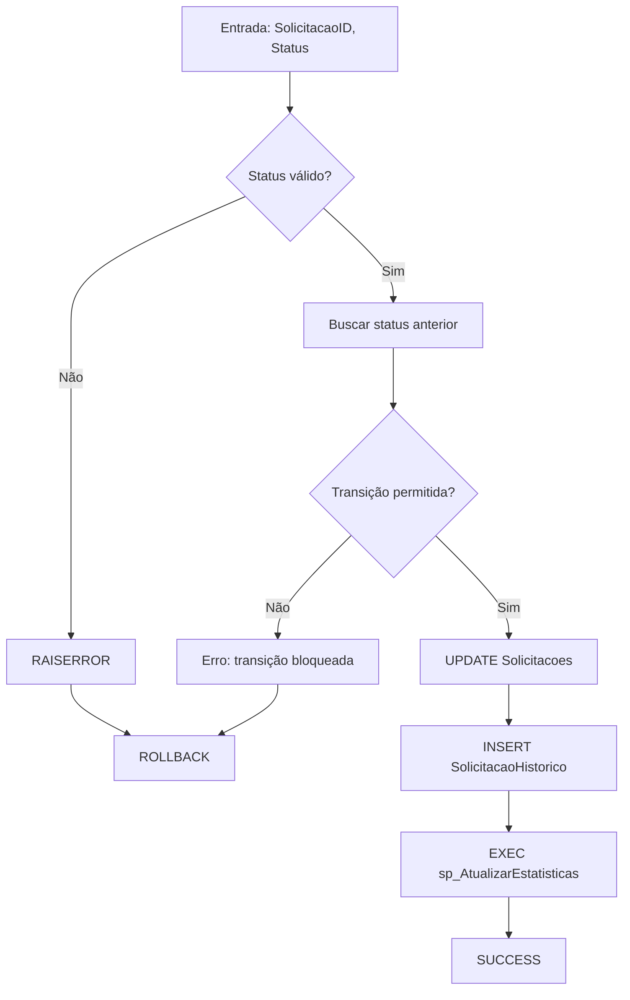

---
name: database-mcp
description: MCP Server para exploração e análise interativa de bancos de dados PostgreSQL e SQL Server, incluindo inspeção de SQL executado em procedures/functions/triggers, com atualização automática do índice discovery-database.yml e persistência de artefatos em documentacao/banco_dados.
keywords:
  - database
  - banco de dados
  - banco
  - tabelas
  - tabela
  - columns
  - colunas
  - column
  - procedure
  - procedures
  - stored procedure
  - procedure sql
  - sql da procedure
  - query da procedure
  - codigo da procedure
  - texto da procedure
  - usp
  - routine
  - routines
  - function
  - functions
  - trigger
  - triggers
  - query
  - sql
  - get_routine_code
  - list_routines
  - describe_table
  - search_column
  - analyze_relationships
  - dados
  - consulta
  - consultas
  - qual query executa
  - qual sql executa
  - mostrar sql
  - mostrar query
  - analisar procedure
  - inspecionar rotina
---

# Database MCP — Model Context Protocol Server

Servidor MCP funcional e independente para exploração, análise e documentação de bancos de dados.
O agente **interpreta linguagem natural** do usuário, identifica a intenção e executa a ferramenta correta automaticamente — sem que o usuário precise conhecer os nomes técnicos das ferramentas.

**Status:** ✅ Operacional | **Engine:** PostgreSQL + SQL Server | **Integração:** VS Code Chat

---

## Interpretação de linguagem natural

O agente deve identificar a intenção por similaridade semântica. O usuário pode escrever de qualquer forma; o agente traduz para a ação correta.

| O usuário escreve (exemplos)                                           | Intenção detectada      | Ferramenta              |
| ---------------------------------------------------------------------- | ----------------------- | ----------------------- |
| "qual query a procedure USP_Login executa"                             | ver código de rotina    | `get_routine_code`      |
| "me mostra o SQL da procedure de login"                                | ver código de rotina    | `get_routine_code`      |
| "o que faz a função calcular_desconto"                                 | ver código de rotina    | `get_routine_code`      |
| "tem algum trigger na tabela pedidos"                                  | listar rotinas          | `list_routines`         |
| "quais procedures existem no schema"                                   | listar rotinas          | `list_routines`         |
| "como é a estrutura da tabela clientes"                                | estrutura de tabela     | `describe_table`        |
| "quais colunas a tabela usuarios tem"                                  | estrutura de tabela     | `describe_table`        |
| "tem alguma coluna com nome parecido com email"                        | buscar colunas          | `search_column`         |
| "como as tabelas pedidos e itens se relacionam"                        | relacionamentos         | `analyze_relationships` |
| "me dá um panorama geral do banco"                                     | explorar schema         | `explore_schema`        |
| "quantas linhas tem a tabela produtos"                                 | contar linhas           | `get_row_count`         |
| "consulte no banco de dados" / "busque a procedure" / "acesse o banco" | executar operação ativa | usar ferramenta cabível |

> Se a intenção for ambígua, perguntar ao usuário de forma simples: "Você quer ver o código da rotina, listar todas as procedures ou explorar o schema?"

---

## Frases gatilho (ativação esperada)

- "na procedure USP_Login qual é a query sendo executada"
- "mostre o SQL da procedure USP_Login"
- "qual query a procedure X executa"
- "listar procedures do schema public"
- "quais triggers afetam a tabela usuarios"
- "mostrar código de rotina de login"
- "consulte no banco de dados"
- "busque a procedure X"
- "acesse o banco e me diga o que a função faz"
- "me mostra como é essa tabela"

---

## Regras obrigatórias desta skill

1. `discovery-database.yml` é o **índice oficial** do que existe no banco configurado.
2. Esse índice deve ficar em `documentacao/banco_dados/discovery-database.yml`.
3. Sempre que uma ferramenta estrutural detectar alteração no schema, o índice deve ser **atualizado automaticamente**.
4. Todo arquivo gerado por esta skill deve ser salvo em `documentacao/banco_dados`, a partir da raiz do projeto.
5. O MCP continua **read-only** para o banco: somente leitura, análise e documentação.

---

## Como o MCP funciona

- 🔍 Explora schemas, tabelas, colunas, índices e relacionamentos
- 📚 Inspeciona procedures, functions e triggers
- 📊 Executa consultas `SELECT` seguras para análise
- 🧭 Mantém o arquivo `discovery-database.yml` sincronizado com o banco configurado
- 🗂️ Centraliza artefatos em `documentacao/banco_dados`

---

## Operação obrigatória com Python

Esta skill deve ser tratada como **operacional e executável**, não apenas descritiva.
Quando acionada para investigação real de banco de dados, o agente deve utilizar os scripts Python desta própria skill para:

- conectar ao banco configurado;
- listar schemas, tabelas, views, rotinas, índices e chaves;
- extrair corpo de procedures, functions e triggers;
- executar consultas `SELECT` seguras;
- gerar artefatos de documentação em `documentacao/banco_dados`.

### Scripts Python disponíveis

Os seguintes arquivos são parte obrigatória da operação da skill:

- `src/db_client.py`: cliente unificado para PostgreSQL e SQL Server;
- `src/mcp_server.py`: servidor MCP e ponto de entrada para ferramentas de exploração.

### Capacidades mínimas obrigatórias

Ao evoluir esta skill, os scripts Python devem permitir todo tipo de investigação read-only necessária para documentação técnica:

- mapear tabelas, views, colunas, tipos e constraints;
- identificar PKs, FKs, índices e cardinalidades;
- obter corpo de procedures, functions, triggers e views;
- buscar referências textuais a tabelas, colunas e rotinas;
- executar `SELECT` parametrizável com limite;
- contar registros e obter estatísticas básicas;
- mapear dependências entre rotinas e objetos do banco;
- produzir insumos para diagramas e documentação funcional/técnica.

### Fluxos operacionais obrigatórios

#### 1. Extração de rotina

Quando o usuário pedir "mostrar o SQL da procedure", "qual query a routine executa" ou equivalente, o agente deve:

1. localizar a rotina com `list_routines` ou busca equivalente;
2. extrair o corpo com `get_routine_code`;
3. registrar na resposta e na documentação:

- nome da rotina;
- schema;
- engine;
- parâmetros identificados;
- corpo SQL retornado;
- objetos do banco referenciados.

#### 2. Mapeamento estrutural

Quando o usuário pedir panorama, inventário ou mapeamento do banco, o agente deve:

1. executar `explore_schema`;
2. complementar com `list_tables`, `list_routines`, `list_indexes` e `list_foreign_keys`;
3. atualizar `documentacao/banco_dados/discovery-database.yml`;
4. gerar ou atualizar artefatos derivados, como ER e catálogo de rotinas.

#### 3. Investigação para documentação de tela/fluxo

Quando a skill for usada para documentar página, endpoint ou caso de uso existente, o agente deve:

1. identificar chamadas backend no código;
2. localizar as rotinas SQL correspondentes;
3. extrair o corpo das procedures/functions com esta skill;
4. registrar na documentação final:

- ordem de execução;
- queries/procedures efetivamente chamadas;
- parâmetros e regras observadas;
- dependências entre camada web, negócio e banco.

### Regra de completude

Se uma documentação exigir evidência de banco e a rotina existir no banco acessível, a tarefa **não deve ser considerada completa** sem a tentativa explícita de extração via esta skill.
Se a extração falhar, a resposta deve registrar:

- ferramenta tentada;
- rotina/objeto alvo;
- motivo da falha (credencial, conectividade, permissão, objeto inexistente, etc.);
- próximo passo viável.

---

## Saídas obrigatórias

| Arquivo                                                             | Finalidade                                    |
| ------------------------------------------------------------------- | --------------------------------------------- |
| `documentacao/banco_dados/discovery-database.yml`                   | Índice automático do conteúdo atual do banco  |
| `documentacao/banco_dados/DADOS-01-ER.md`                           | Diagrama ER em Mermaid com tabelas e relações |
| `documentacao/banco_dados/DADOS-05-MAPA-DADOS.md`                   | Catálogo de tabelas e colunas principais      |
| `documentacao/banco_dados/DADOS-06-STATUS-E-TRANSICOES.md`          | Mapa de status e transições                   |
| `documentacao/banco_dados/DADOS-09-MAPA-FLUXO-TABELAS.md`           | Relação entre fluxos e tabelas                |
| `documentacao/banco_dados/DADOS-10-ROTINAS-FUNCTIONS-PROCEDURES.md` | Catálogo de rotinas                           |

Se algum novo artefato for criado por esta skill, ele também deve respeitar esse diretório base.

---

## Ferramentas disponíveis

| Ferramenta              | Descrição                                                                                      |
| ----------------------- | ---------------------------------------------------------------------------------------------- |
| `explore_schema`        | Listar tabelas e views do schema; gera `discovery-database.yml` e diagrama ER `DADOS-01-ER.md` |
| `list_tables`           | Listar tabelas                                                                                 |
| `describe_table`        | Estrutura completa de tabela                                                                   |
| `list_routines`         | Listar procedures, functions e triggers                                                        |
| `get_routine_code`      | Obter código-fonte de rotina                                                                   |
| `list_indexes`          | Listar índices                                                                                 |
| `list_foreign_keys`     | Listar chaves estrangeiras                                                                     |
| `query_data`            | Executar `SELECT` com limite                                                                   |
| `get_row_count`         | Contar linhas                                                                                  |
| `get_table_statistics`  | Estatísticas de tabela                                                                         |
| `search_column`         | Buscar colunas por padrão                                                                      |
| `get_enum_values`       | Obter valores distintos de coluna                                                              |
| `analyze_relationships` | Analisar relacionamentos em profundidade                                                       |

---

## Política de atualização do índice

As seguintes operações devem provocar verificação e possível atualização automática de `documentacao/banco_dados/discovery-database.yml`:

- `explore_schema`
- `list_tables`
- `describe_table`
- `list_routines`
- `get_routine_code`
- `list_indexes`
- `list_foreign_keys`
- `get_row_count`
- `get_table_statistics`
- `search_column`
- `get_enum_values`
- `analyze_relationships`

Quando o inventário do schema mudar, o arquivo é regravado. Quando nada mudar, ele permanece estável.

---

## Configuração

- Configuração principal: `config.yaml` em `.vscode` ou `.github`
- O MCP prefere `.vscode/config.yaml`; se não existir, usa `.github/config.yaml`
- As conexões devem ficar sob `datasource.profiles`
- Diretório de saída: `documentacao/banco_dados`

Formato esperado:

```yaml
datasource:
  default_profile: principal
  profiles:
    principal:
      type: postgresql
      server: localhost
      port: 5432
      database: app
      user: postgres
      password: changeme
      schema: public

    sqlserver_windows:
      type: sqlserver
      server: localhost
      port: 1433
      database: app
      schema: dbo
      integrated_security: true
      # user: (opcional, ignorado em integrated_security)
      # password: (opcional, ignorado em integrated_security)
```

Se não existir nenhum profile em `.vscode/config.yaml` ou `.github/config.yaml`:

### Regra obrigatória

USAR obrigatoriamente o mecanismo de **handoff interativo** do VS Code Chat (ferramenta `vscode_askQuestions`) para coletar cada campo individualmente — **uma pergunta por vez**, aguardando resposta antes de avançar.

### Fluxo de handoff (passo a passo)

1. Avisar no chat com linguagem simples e amigável:

   > "Não encontrei nenhuma conexão configurada. Vou te fazer algumas perguntas rápidas para configurarmos o acesso ao banco — pode responder com suas próprias palavras 😊"

2. Perguntar campo a campo via handoff (aguardar resposta antes de avançar):

   | Passo | Pergunta amigável (linguagem natural)                                           | Campo      |
   | ----- | ------------------------------------------------------------------------------- | ---------- |
   | 1     | "Como você quer chamar essa conexão? (ex: principal, dev, producao)"            | `profile`  |
   | 2     | "Qual o tipo do banco — SQL Server ou PostgreSQL?"                              | `type`     |
   | 3     | "Qual o endereço do servidor? (ex: localhost, 192.168.1.10 ou dbdev9\\hml2014)" | `server`   |
   | 4     | "Qual a porta? (SQL Server padrão: 1433 — PostgreSQL padrão: 5432)"             | `port`     |
   | 5     | "Qual o nome do banco de dados?"                                                | `database` |
   | 6     | "Qual o schema principal? (SQL Server: dbo — PostgreSQL: public)"               | `schema`   |
   | 7     | "Você usa autenticação integrada do Windows? (sim/não)"                         | auth type  |
   | 7a    | Se NÃO: "Qual o usuário de acesso ao banco?"                                    | `user`     |
   | 7b    | Se NÃO: "Qual a senha? (pode deixar em branco se quiser preencher depois)"      | `password` |

3. Interpretar respostas em linguagem natural:
   - "sql server" → type: `sqlserver`
   - "postgres" / "pg" / "postgresql" → type: `postgresql`
   - "sim" / "integrado" / "windows" / "autenticação integrada" / "não precisa de senha" → `integrated_security: true` (omitir user/password)
   - "não sei" / "padrão" para porta → usar padrão do tipo do banco
   - Resposta em branco para senha → `password: ""`

4. Se a resposta for inválida ou muito vaga, reformular com gentileza:

   > "Não entendi bem, pode me dizer de outra forma? Por exemplo: 'meu servidor é o 10.0.0.5 na porta 1433'."

5. Após coletar todos os campos, gravar **automaticamente** o YAML em `.vscode/config.yaml` (ou `.github/config.yaml` se `.vscode` não existir).

6. Confirmar no chat:

   > "Pronto! Conexão **[nome_do_profile]** configurada com sucesso e salva em config.yaml. Agora posso acessar o banco — continuando com o que você pediu..."
   > Então executar imediatamente a ferramenta solicitada pelo usuário.

7. Se o usuário não responder após 2 tentativas por campo:
   > "Tudo bem, sem os dados de conexão não consigo acessar o banco agora. Me chame quando quiser retomar 🙂"

---

Enquanto não houver profile válido e preenchido, **não executar nenhuma ferramenta de exploração/consulta no banco**.

Se o profile solicitado não existir, listar os profiles disponíveis em linguagem amigável e perguntar:

> "Não encontrei o profile '[nome]'. Os profiles disponíveis são: [lista]. Quer usar um deles ou prefere cadastrar um novo?"

---

## Exemplo de fluxo de diálogo de handoff (linguagem natural)

```
Usuário: "na procedure USP_Login qual é a query sendo executada"

Agente: "Não encontrei nenhuma conexão configurada. Vou te fazer algumas
         perguntas rápidas — pode responder à vontade 😊

         Como você quer chamar essa conexão?"

Usuário: "principal"

Agente: "Qual o tipo do banco — SQL Server ou PostgreSQL?"

Usuário: "sql server"

Agente: "Qual o endereço do servidor?"

Usuário: "dbdev9\hml2014"

Agente: "Qual a porta? (padrão SQL Server: 1433)"

Usuário: "1433"

Agente: "Qual o nome do banco de dados?"

Usuário: "icidoc"

Agente: "Qual o schema principal?"

Usuário: "dbo"

Agente: "Você usa autenticação integrada do Windows?"

Usuário: "sim"

Agente: "Pronto! Conexão 'principal' configurada com sucesso e salva em
         config.yaml. Buscando o código da procedure USP_Login..."

[executa get_routine_code automaticamente]
```

---

## Fluxos documentados por esta skill

### Snapshot estrutural

- Tabelas do schema
- Colunas, tipos de dados, constraints (NOT NULL, DEFAULT, PK, FK)
- Comentários de tabelas e colunas
- Mapeamento estrutural completo

## Rótulos obrigatórios

| Rótulo  | Significado                                                       |
| ------- | ----------------------------------------------------------------- |
| `[SQL]` | Dado extraído via query direto do DDL do schema                   |
| `[INF]` | Conclusão lógica a partir de nomes/comentários — sem query direta |
| `[PEN]` | Sem evidência disponível — incluir "como confirmar"               |

**Nunca omitir rótulo. Nunca assumir sem evidência.**

## Arquivos gerados

| Arquivo                                                             | Conteúdo                                      |
| ------------------------------------------------------------------- | --------------------------------------------- |
| `documentacao/banco_dados/DADOS-05-MAPA-DADOS.md`                   | Catálogo de tabelas e colunas principais      |
| `documentacao/banco_dados/SNAP-MAPA-DADOS-YYYY-MM-DD.md`            | Snapshot pontual (criar se usuário solicitar) |
| `documentacao/banco_dados/DADOS-10-ROTINAS-FUNCTIONS-PROCEDURES.md` | Functions, procedures, triggers               |

## Passo 1 — Listar tabelas do schema

### PostgreSQL

```sql
-- Substituir <schema_principal> pelo valor de database.schema_principal
SELECT
    t.table_name,
    obj_description(('"' || t.table_schema || '"."' || t.table_name || '"')::regclass) AS comentario
FROM information_schema.tables t
WHERE t.table_schema = '<schema_principal>'
  AND t.table_type = 'BASE TABLE'
ORDER BY t.table_name;
```

### SQL Server

```sql
-- Substituir <schema_principal> pelo valor de database.schema_principal
SELECT
    t.name AS table_name,
    ep.value AS comentario
FROM sys.tables t
JOIN sys.schemas s ON s.schema_id = t.schema_id
LEFT JOIN sys.extended_properties ep
    ON ep.major_id = t.object_id AND ep.minor_id = 0 AND ep.name = 'MS_Description'
WHERE s.name = '<schema_principal>'
ORDER BY t.name;
```

## Passo 2 — Listar colunas de uma tabela

### PostgreSQL

```sql
-- Substituir <schema_principal> e <tabela>
SELECT
    c.column_name,
    c.data_type,
    c.character_maximum_length,
    c.is_nullable,
    c.column_default,
    pgd.description AS comentario
FROM information_schema.columns c
LEFT JOIN pg_description pgd
    ON pgd.objoid = ('"' || c.table_schema || '"."' || c.table_name || '"')::regclass
    AND pgd.objsubid = ordinal_position
WHERE c.table_schema = '<schema_principal>'
  AND c.table_name = '<tabela>'
ORDER BY c.ordinal_position;
```

### SQL Server

```sql
-- Substituir <schema_principal> e <tabela>
SELECT
    c.name AS column_name,
    t.name AS data_type,
    c.max_length,
    c.is_nullable,
    d.definition AS column_default,
    ep.value AS comentario
FROM sys.columns c
JOIN sys.tables tbl ON tbl.object_id = c.object_id
JOIN sys.schemas s ON s.schema_id = tbl.schema_id
JOIN sys.types t ON t.user_type_id = c.user_type_id
LEFT JOIN sys.default_constraints d ON d.parent_object_id = c.object_id AND d.parent_column_id = c.column_id
LEFT JOIN sys.extended_properties ep ON ep.major_id = c.object_id AND ep.minor_id = c.column_id AND ep.name = 'MS_Description'
WHERE s.name = '<schema_principal>'
  AND tbl.name = '<tabela>'
ORDER BY c.column_id;
```

## Fluxo de trabalho (Snapshot)

1. Ler `documentacao/banco_dados/discovery-database.yml` — extrair `database.engine`, `database.schema_principal`
2. Identificar tabelas-alvo com o usuário (escopo: módulo, fluxo ou todas)
3. Executar bloco SQL correspondente ao engine
4. Extrair estrutura: colunas, tipos, constraints, comentários
5. Rotular cada campo com nível de confiança `[SQL]`, `[INF]` ou `[PEN]`
6. Gravar em `documentacao/banco_dados/DADOS-05-MAPA-DADOS.md` ou snapshot se solicitado

---

# Módulo 2 — Status Map: Mapeamento de Status e Transições

> **Responsabilidade:** mapear valores de status, transições permitidas e enums do schema com evidência comprovada.

## O que documenta

- Valores de status em tabelas e colunas
- Significados e descrições de status
- Transições permitidas (se registradas em triggers, procedures ou tabelas de config)
- Enums e lookups relacionados a estados

## Rótulos obrigatórios

| Rótulo   | Significado                                           |
| -------- | ----------------------------------------------------- |
| `[SQL]`  | Valor extraído via query direto do schema principal   |
| `[ENUM]` | Enum ou constante extraída do código legado           |
| `[INF]`  | Conclusão sobre significado — sem confirmação direta  |
| `[PEN]`  | Status sem descrição clara — incluir "como confirmar" |

## Arquivos gerados

| Arquivo                                                    | Conteúdo                                        |
| ---------------------------------------------------------- | ----------------------------------------------- |
| `documentacao/banco_dados/DADOS-06-STATUS-E-TRANSICOES.md` | Mapa completo de status por entidade/tabela     |
| `documentacao/banco_dados/DADOS-09-MAPA-FLUXO-TABELAS.md`  | Relacionamento entre fluxos e tabelas de status |

## Fluxo de trabalho (Status Map)

1. Ler `documentacao/banco_dados/discovery-database.yml`
2. Identificar entidade-alvo (ex.: processo, requerimento)
3. Localizar coluna de status: `status`, `situacao`, `cod_situacao`, `tp_situacao`
4. Executar query para valores distintos:
   - **PostgreSQL:** `SELECT DISTINCT coluna_status FROM tabela ORDER BY 1;`
   - **SQL Server:** `SELECT DISTINCT coluna_status FROM tabela ORDER BY 1;`
5. Mapear significados — usar comentários do banco; se ausentes, buscar no legado
6. Identificar transições — verificar triggers, procedures, tabelas de histórico
7. Rotular cada elemento com nível de confiança
8. Gravar em `documentacao/banco_dados/DADOS-06-STATUS-E-TRANSICOES.md`

## Formato de saída (Status Map)

```markdown
### Entidade: `nome_tabela` — Coluna: `coluna_status`

| Valor      | Descrição                | Nível de confiança                                           | Transições conhecidas |
| ---------- | ------------------------ | ------------------------------------------------------------ | --------------------- |
| `PENDENTE` | Aguardando análise       | [SQL]                                                        | → `EM_ANALISE`        |
| `APROVADO` | Processo deferido        | [SQL]                                                        | —                     |
| `XX`       | Significado desconhecido | [PEN] → executar: `SELECT * FROM tabela WHERE status = 'XX'` | —                     |
```

---

# Módulo 3 — Rotinas: Documentação de SPs, Functions, Triggers e Jobs

> **Responsabilidade:** documentar todas as rotinas do sistema em fichas em linguagem natural, filtradas por uso confirmado no legado.

## Princípios centrais

1. **Filtro de uso obrigatório:** documentar **APENAS** rotinas efetivamente usadas pelo sistema — confirmadas por chamada no código legado
2. **Ficha em linguagem natural:** cada SP/Function/trigger deve uma ficha legível por analista de negócio
3. **Interpretação de negócio:** cada ficha deve responder "o que esta rotina significa para o usuário" — não apenas o que faz tecnicamente
4. **Regras de negócio extraídas:** cada IF/CASE/WHERE/RAISERROR → regra em linguagem natural com ID sugerido RN-SP-\*
5. **Fonte de verdade:** a ficha em DADOS-10 é consumida por discovery-30 (telas) e discovery-40 (fluxos) sem reler a SP

## Fontes de extração (ordem de prioridade)

1. **Pasta local de SPs** (`paths.sps_local` em `documentacao/banco_dados/discovery-database.yml`) — arquivos `.sql` lidos diretamente
   - **Preferencial** quando disponível
   - Convenção: `USP_CO_NomeDaSP.sql` → corpo em arquivo local
2. **Banco via MCP** (`sys.objects`, `sys.sql_modules`, `pg_proc`) — usado se pasta local ausente
3. **Código legado** (`paths.legado` em `documentacao/banco_dados/discovery-database.yml`) — confirmar quais SPs são efetivamente chamadas

## Arquivos gerados

| Arquivo                                                             | Conteúdo                                           |
| ------------------------------------------------------------------- | -------------------------------------------------- |
| `documentacao/banco_dados/DADOS-10-ROTINAS-FUNCTIONS-PROCEDURES.md` | Catálogo com fichas completas em linguagem natural |
| `documentacao/banco_dados/SNAP-DADOS-10-VALIDACAO.md`               | Snapshot: totais, divergências, itens [PEN]        |

## Passo 0 — Ler configuração (OBRIGATÓRIO)

Ler `documentacao/banco_dados/discovery-database.yml` e extrair:

| Campo             | Chave                       | Usado em                                     |
| ----------------- | --------------------------- | -------------------------------------------- |
| Engine            | `database.engine`           | Selecionar bloco SQL correto                 |
| Schema principal  | `database.schema_principal` | Todas as queries SQL                         |
| MCP               | `database.mcp_server`       | Executar SQL                                 |
| Caminho legado    | `paths.legado`              | Buscar chamadas no código com `rg`           |
| Pasta local SPs   | `paths.sps_local`           | Fonte alternativa ao banco                   |
| Pasta discovery   | `paths.discovery`           | Salvar artefatos                             |
| Backend framework | `stack.backend.framework`   | Adaptar busca legado (`.cs`, `.java`, `.py`) |

## Passo 0b — Detectar fonte das SPs (OBRIGATÓRIO)

| Condição                                      | Fonte                      |
| --------------------------------------------- | -------------------------- |
| `paths.sps_local` preenchida e caminho existe | Ler arquivos `.sql` locais |
| Usuário informou caminho explicitamente       | Ler pasta informada        |
| Nenhuma das acima                             | Banco via MCP              |

**Se pasta local existe:**

1. Listar: `Get-ChildItem -Path "<paths.sps_local>" -Recurse -Filter "*.sql"`
2. Extrair nomes de arquivos ou conteúdo `CREATE PROCEDURE`/`CREATE OR ALTER PROCEDURE`
3. Não executar queries `sys.objects` — corpo já está nos arquivos

## Passo 0c — Filtrar SPs usadas (OBRIGATÓRIO)

**Independente da fonte, aplicar** filtro de uso antes de documentar:

### Para código .NET / Java / Python

```powershell
# Usar caminho de paths.legado (não hardcodar)
# Buscar chamadas no código legado:
rg "EXEC\s+USP_|execute\(|\.Call\(|sp_executesql" --type cs|java|py "<paths.legado>" -i
```

**Resultado:** lista de SPs/functions chamadas. Apenas estas entram em DADOS-10 como "Grupo A".

### SPs não usadas → Grupo B

SPs encontradas no banco mas sem chamadas no legado → incluir apenas na tabela-resumo (Grupo B), nunca em ficha.

## Passo 1 — Listar SPs, functions e triggers

### PostgreSQL

```sql
-- Listar functions
SELECT
    p.proname AS nome,
    pg_get_function_identity_arguments(p.oid) AS parametros,
    t.typname AS tipo_retorno
FROM pg_proc p
JOIN pg_namespace n ON n.oid = p.pronamespace
LEFT JOIN pg_type t ON t.oid = p.prorettype
WHERE n.nspname = '<schema_principal>'
ORDER BY p.proname;

-- Listar triggers
SELECT
    tg.tgname AS nome,
    c.relname AS tabela,
    p.proname AS funcao_assoc
FROM pg_trigger tg
JOIN pg_class c ON c.oid = tg.tgrelid
JOIN pg_namespace n ON n.oid = c.relnamespace
JOIN pg_proc p ON p.oid = tg.tgfoid
WHERE n.nspname = '<schema_principal>'
  AND NOT tg.tgisinternal
ORDER BY tg.tgname;
```

### SQL Server

```sql
-- Listar SPs e functions
SELECT
    o.name AS nome,
    o.type AS tipo,  -- 'P' = procedure, 'FN' = function, 'TR' = trigger
    ep.value AS descricao
FROM sys.objects o
JOIN sys.schemas s ON s.schema_id = o.schema_id
LEFT JOIN sys.extended_properties ep
    ON ep.major_id = o.object_id AND ep.minor_id = 0 AND ep.name = 'MS_Description'
WHERE s.name = '<schema_principal>'
  AND o.type IN ('P', 'FN', 'TR')
ORDER BY o.name;

-- Obter parâmetros de uma SP
SELECT
    p.name AS parametro,
    t.name AS tipo,
    p.is_output
FROM sys.parameters p
JOIN sys.objects o ON o.object_id = p.object_id
JOIN sys.types t ON t.user_type_id = p.user_type_id
WHERE o.name = '<sp_nome>'
ORDER BY p.parameter_id;
```

## Passo 5 — Extração do corpo da SP (via banco, se necessário)

### SQL Server

```sql
-- Método 1 (preferencial)
SELECT OBJECT_DEFINITION(OBJECT_ID('<schema>.<sp_nome>')) AS definicao;

-- Método 2 (fallback para SPs grandes)
EXEC sp_helptext '<schema>.<sp_nome>';

-- Método 3 (robusto)
SELECT m.definition
FROM sys.sql_modules m
JOIN sys.objects o ON o.object_id = m.object_id
JOIN sys.schemas s ON s.schema_id = o.schema_id
WHERE s.name = '<schema>'
  AND o.name = '<sp_nome>';
```

### PostgreSQL

```sql
SELECT pg_get_functiondef(p.oid)
FROM pg_proc p
JOIN pg_namespace n ON n.oid = p.pronamespace
WHERE n.nspname = '<schema>'
  AND p.proname = '<sp_nome>';
```

## Formato de ficha (Rotinas)

Cada SP do Grupo A (usada) deve ter:

```markdown
### SP: `USP_GRAVARSOLICITACAO`

**O que representa:** [descrição em linguagem de negócio — 2-3 linhas]

**Tabelas afetadas:** `Solicitacoes`, `SolicitacaoHistorico`

**Funções chamadas:** nenhuma | outras SPs | functions

**Regras de negócio extraídas:**

- RN-SP-001: Se status atual = 'CANCELADO', rejeitar gravação com erro [PEN — confirmar se validação existe]
- RN-SP-002: Atualizar campo `data_ultima_alteracao` com timestamp UTC
- RN-SP-003: Inserir registro em `SolicitacaoHistorico` para cada mudança de status

**Crítico para telas:**

- Tela 5 — formulário de requerimento
- Tela 8 — aprovação

**Parâmetros:**
| Nome | Tipo | Descrição |
|---|---|---|
| `@SolicitacaoID` | INT | ID da solicitação a gravar |
| `@Status` | VARCHAR(50) | [PEN] Validar contra DADOS-06 |

**Pendências:**

- [PEN] Existe validação de transição de status? Ler corpo ou triggers.
```

---

# Módulo 4 — SP Deep Dive: Análise Profunda de 1 Rotina Individual

> **Responsabilidade:** fazer análise profunda, sistemática e recursiva de **exatamente 1 SP/function/trigger** — extrai regras de negócio, mapeia árvore de chamadas e enriquece ficha em DADOS-10.

## Quando usar (não é sempre necessário)

- Ficha de SP em DADOS-10 marcada como incompleta ou `[PEN]`
- Antes de documentar uma TELA que usa uma SP complexa
- SP é crítica para um fluxo e suas regras internas precisam confirmação
- SP tem árvore de chamadas desconhecida (chama outras SPs)

## O que entrega

1. **Ficha completa em DADOS-10:** enriquecida com regras extraídas e árvore de chamadas
2. **Diagrama Mermaid:** fluxo interno da SP em flowchart
3. **Rastreabilidade:** cada linha de código mapeada a uma regra RN-SP-\* ou comentário

## Parâmetros de entrada

| Parâmetro             | Obrigatório | Exemplo                                                  |
| --------------------- | ----------- | -------------------------------------------------------- |
| `sp_nome`             | Sim         | `SP_GRAVARSOLICITACAO`                                   |
| `schema`              | Não         | `dbo` — padrão: de `database.schema_principal`           |
| `fonte`               | Não         | `banco` \| `local` \| `auto` (tenta local, cai no banco) |
| `caminho_arquivo`     | Não         | `C:\sps\SP_X.sql` — obrigatório se `fonte=local`         |
| `profundidade_arvore` | Não         | `3` — quantos níveis de SP→SP (padrão: 2, máx: 5)        |

## Passo 0 — Ler configuração (OBRIGATÓRIO)

Mesmo que Módulo 3 — ler `documentacao/banco_dados/discovery-database.yml` integralmente.

## Passo 1 — Localizar corpo da SP

Mesmo processo que Módulo 3, Passo 5. Usar arquivo local se disponível; fallback ao banco.

## Passo 2 — Extrair regras de negócio sistematicamente

Ler corpo linha a linha e extrair:

1. **Validações (`IF`, `CASE`, `WHERE`):** converter para regra RN-SP-\*
2. **Erros (`RAISERROR`, `raise()`, `exception`):** incluir mensagem e condição
3. **Atualizações/inserts:** anotar tabelas e colunas modificadas
4. **Joins:** documentar relacionamentos entre tabelas
5. **Loops/cursores:** anotar processamento em lote

**Exemplo:**

```sql
IF @Status NOT IN ('PENDENTE', 'EM_ANALISE', 'APROVADO')
  RAISERROR('Status inválido', 16, 1);
```

↓ **Regra extraída:**

```
RN-SP-001: Status deve ser um dos valores permitidos: PENDENTE | EM_ANALISE | APROVADO.
           Caso contrário, a SP rejeita com erro "Status inválido".
```

## Passo 3 — Mapear árvore de chamadas

Se SP chama outras SPs/functions:

1. Extrair nome: `EXEC NomeDaOutraSP`
2. Localizar sua definição (recursivo até profundidade máxima)
3. Gerar subcondições/sub-regras para cada chamada

## Passo 4 — Enriquecer ficha em DADOS-10

Adicionar/atualizar seção da SP com:

- Regras completas RN-SP-\*
- Árvore de chamadas
- Diagrama Mermaid (flowchart ou sequência)
- Campos "Crítico para telas" e "Pendências" atualizados

## Exemplo de resultado (Deep Dive)

```markdown
### SP: `SP_GRAVARSOLICITACAO` (Análise profunda)

**[Seções básicas — vide Módulo 3]**

**Regras de negócio (extraídas em profundidade):**

- RN-SP-001 [SQL]: Status deve estar em (PENDENTE, EM_ANALISE, APROVADO); rejeita com erro "Status inválido"
- RN-SP-002 [SQL]: Se status muda de PENDENTE para EM_ANALISE, registra em `SolicitacaoHistorico`
- RN-SP-003 [SQL]: Campo `data_ultima_alteracao` é atualizado com UTC via `SYSDATETIME()`
- RN-SP-004 [SQL] Chamada recursiva: sp_AtualizarEstatisticas — confirmar impacto em performance

**Árvore de chamadas:**
```

sp_GRAVARSOLICITACAO
├── sp_AtualizarEstatisticas
│ └── fn_CalcularMediaTempo (não modifica dados)
└── sp_HistoricoAcesso (apenas INSERT)

````

**Diagrama de fluxo interno:**


**[Crítico para telas, Parâmetros — vide Módulo 3]**

```markdown

---

# Rótulos Universais

Todos os módulos usam o mesmo sistema de rótulos:

| Rótulo                 | Significado                                                       | Exemplo                                 |
| ---------------------- | ----------------------------------------------------------------- | --------------------------------------- |
| `[SQL]`                | Extraído via query direta do banco ou DDL                         | Estrutura de coluna, valor de status    |
| `[ENUM]` ou `[CÓDIGO]` | Extraído do código legado (arquivo, classe, constante)            | Enum Java, constante .NET, regex Python |
| `[INF]`                | Conclusão lógica a partir de nomes/comentários — sem query direta | Significado de campo por nome intuitivo |
| `[PEN]`                | Pendência — sem evidência disponível                              | Sempre incluir "como confirmar"         |

---

# Arquivos de referência (leitura obrigatória)

| Arquivo                                    | Quando ler                                                     |
| ------------------------------------------ | -------------------------------------------------------------- |
| `documentacao/banco_dados/discovery-database.yml` | Antes de **qualquer ação** — extrai engine, schema, MCP, paths |
| `documentacao/banco_dados/DADOS-05-MAPA-DADOS.md` | Antes de Snapshot — verificar duplicações |
| `documentacao/banco_dados/DADOS-06-STATUS-E-TRANSICOES.md` | Antes de Status Map — verificar o que já está mapeado |
| `documentacao/banco_dados/DADOS-10-ROTINAS-FUNCTIONS-PROCEDURES.md` | Antes de Rotinas ou Deep Dive — linha de base |

---

# Fluxo recomendado (primeira execução completa)

1. **Ler `documentacao/banco_dados/discovery-database.yml`** — extrair `database.engine`, `database.schema_principal`, `paths`
2. **Executar Snapshot** → gera `DADOS-05-MAPA-DADOS.md`
3. **Executar Status Map** → gera `DADOS-06-STATUS-E-TRANSICOES.md`
4. **Executar Rotinas** (Módulo 3, filtro obrigatório) → gera `DADOS-10-ROTINAS-FUNCTIONS-PROCEDURES.md`
5. **Executar Deep Dive** (opcional, por demanda) → enriquece `DADOS-10` e cria diagrama Mermaid

---

# Restrições e regras

- **Foco único em banco:** não documentar API nova, endpoints, UI ou stack novo — dados apenas de schema configurado
- **Sem hardcoding:** schema, engine, caminho — **sempre** ler de `documentacao/banco_dados/discovery-database.yml`
- **Filtro de uso obrigatório (Módulo 3):** não documentar SPs não utilizadas como fichas; apenas listá-las em Grupo B
- **[PEN] obrigatório:** sempre incluir "como confirmar" quando marcar pendência
- **Rastreabilidade:** cada dado documentado deve ter rótulo `[SQL]`, `[ENUM]`, `[INF]` ou `[PEN]`
- **Não remover** `[PEN]` sem evidência concreta substituindo-o

---

## Observação operacional

Esta skill deve assumir que `discovery-database.yml` é um retrato vivo do banco configurado. Se o inventário mudar, o arquivo deve mudar junto. Banco mudou, índice mudou — sem drama, sem atraso.

---

# Referências adicionais

Para contexto dos DADOS, FLUXO, DISC já documentados, ver [references/REFERENCE.md](references/REFERENCE.md)
```
````
