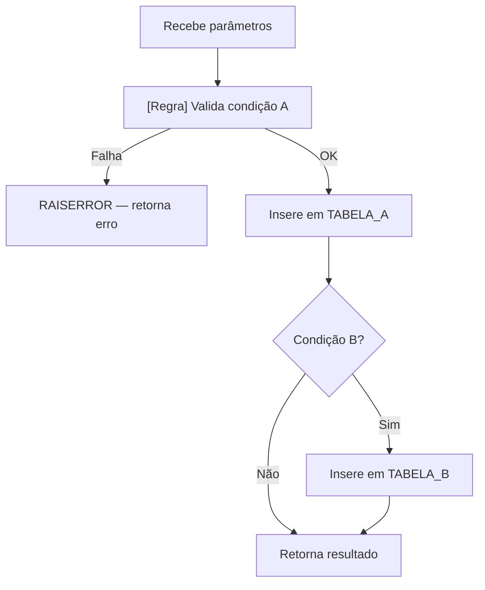
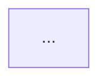

---
name: discovery-13-banco-sp-aprofundar
description: Faz deep-dive completo de uma stored procedure (SP), function ou trigger individual — lê o corpo via MCP ou arquivo local, extrai sistematicamente todas as regras de negócio (IF/CASE/WHERE/JOIN/RAISERROR), mapeia a árvore de chamadas recursiva (SP chamando SP), gera diagrama Mermaid do fluxo interno, e atualiza/cria a ficha completa em DADOS-10. A ficha gerada é a fonte que discovery - 30 - telas - documentar-tela (Passo 2-B) e discovery - 40 - fluxos - gerar (Seção 9/14) consomem sem precisar reler a SP. Difere de discovery - 12 - banco - rotinas (que processa todas as SPs em lote): esta skill processa exatamente 1 objeto por execução com máxima profundidade. Use quando: a ficha da SP em DADOS-10 estiver incompleta ou marcada como [PEN]; antes de documentar uma TELA que usa uma SP complexa; quando uma SP for crítica para um fluxo e suas regras internas precisarem ser confirmadas; quando a árvore de chamadas de uma SP for desconhecida.
---

# Discovery — SP Deep Dive (Individual, Modo Industrial)

> **Pré-requisito:** `discovery-project.yml` configurado. MCP ativo (se for usar banco como fonte).
> Esta skill processa **exatamente 1 objeto** por execução — SP, function ou trigger.

---

## Princípio desta skill

Esta skill não gera um novo documento — ela **enriquece a ficha existente no DADOS-10** ou cria uma nova ficha se ausente. A ficha resultante deve ser rica o suficiente para que:

- `discovery - 30 - telas - documentar-tela` gere o §8 (Regras de negócio) da tela sem precisar reler a SP
- `discovery - 40 - fluxos - gerar` gere a Seção 9 (Dados) e Seção 14 (Rastreabilidade) sem precisar reler a SP
- `discovery - 13 - banco - sp-aprofundar` possa ser executada em outro nível da árvore de chamadas se necessário

**Hierarquia de confiança:** banco/estrutura (leitura via MCP) > código legado (chamadas confirmadas) > inferência pelo nome

---

## Parâmetros de entrada

| Parâmetro | Obrigatório | Exemplo | Descrição |
|---|---|---|---|
| `sp_nome` | Sim | `SP_GRAVARSOLICITACAO` | Nome exato da SP/function/trigger no banco |
| `schema` | Não | `dbo` | Schema — padrão: lido de `database.schema_principal` no yml |
| `fonte` | Não | `banco` | `banco` (via MCP) · `local` (arquivo .sql) · `auto` (tenta local, cai no banco) |
| `caminho_arquivo` | Não | `C:\sps\SP_X.sql` | Caminho do arquivo .sql — obrigatório se `fonte=local` |
| `profundidade_arvore` | Não | `3` | Quantos níveis recursivos de SP chamando SP mapear (padrão: 2, máximo: 5) |

Se `sp_nome` não for informado: solicitar ao usuário antes de prosseguir.

---

## Passo 0 — Ler configuração (OBRIGATÓRIO)

Ler `discovery-project.yml` e extrair:

| Campo | Chave | Usado em |
|---|---|---|
| Engine do banco | `database.engine` | Selecionar bloco SQL correto |
| Schema principal | `database.schema_principal` | Default do parâmetro `schema` |
| Servidor MCP | `database.mcp_server` | Queries ao banco |
| Pasta local de SPs | `paths.sps_local` | Fonte alternativa se `fonte=auto` |
| Caminho do legado | `paths.legado` | Confirmar chamadas no código |
| Pasta de discovery | `paths.discovery` | Localizar e atualizar DADOS-10 |
| Framework do backend | `stack.backend.framework` | Adaptar busca no legado (`.cs`, `.java`, `.py`) |

---

## Passo 1 — Localizar e ler o corpo da SP

### 1.1 — Determinar a fonte

| Condição | Fonte a usar |
|---|---|
| `fonte=local` e `caminho_arquivo` informado | Ler arquivo diretamente |
| `fonte=auto` e `paths.sps_local` configurado e arquivo existe | Ler arquivo local |
| Qualquer outro caso | Banco via MCP |

### 1.2 — Extração via banco (SQL Server)

```sql
-- Método 1 — preferencial
SELECT OBJECT_DEFINITION(OBJECT_ID('<schema>.<sp_nome>')) AS definicao;
```

```sql
-- Método 2 — fallback se método 1 retornar NULL (SPs grandes > 4000 chars)
EXEC sp_helptext '<schema>.<sp_nome>';
```

```sql
-- Método 3 — alternativa robusta
SELECT m.definition
FROM sys.sql_modules m
JOIN sys.objects o ON o.object_id = m.object_id
JOIN sys.schemas s ON s.schema_id = o.schema_id
WHERE s.name = '<schema>'
  AND o.name = '<sp_nome>';
```

**Para PostgreSQL:**
```sql
SELECT pg_get_functiondef(p.oid)
FROM pg_proc p
JOIN pg_namespace n ON n.oid = p.pronamespace
WHERE n.nspname = '<schema>'
  AND p.proname = '<sp_nome>';
```

### 1.3 — SPs criptografadas

Se a SP estiver criptografada (`WITH ENCRYPTION`), o corpo não é acessível. Nesse caso:
- Criar ficha com campos disponíveis (parâmetros, referências cruzadas)
- Marcar "Lógica principal" como `[PEN] SP criptografada — corpo inacessível`
- Registrar pendência 🔴 Crítico na seção de pendências

---

## Passo 2 — Extrair parâmetros formais

**SQL Server:**
```sql
SELECT
    p.name                          AS parametro,
    TYPE_NAME(p.user_type_id)       AS tipo,
    p.max_length,
    p.is_output                     AS saida,
    p.has_default_value,
    p.default_value
FROM sys.parameters p
JOIN sys.objects o ON o.object_id = p.object_id
JOIN sys.schemas s ON s.schema_id = o.schema_id
WHERE s.name  = '<schema>'
  AND o.name  = '<sp_nome>'
ORDER BY p.parameter_id;
```

---

## Passo 3 — Mapear árvore de chamadas (SPs chamadas por esta SP)

### 3.1 — Dependências diretas via catálogo

**SQL Server:**
```sql
SELECT
    referenced_entity_name    AS objeto_referenciado,
    referenced_class_desc     AS tipo
FROM sys.dm_sql_referenced_entities('<schema>.<sp_nome>', 'OBJECT')
WHERE referenced_class_desc IN ('OBJECT_OR_COLUMN')
ORDER BY referenced_entity_name;
```

### 3.2 — Árvore recursiva (até `profundidade_arvore` níveis)

```sql
;WITH Arvore AS (
    -- Nível 0: objeto raiz
    SELECT
        referenced_entity_name  AS objeto,
        0                       AS nivel,
        CAST('<sp_nome>' AS NVARCHAR(MAX)) AS caminho
    FROM sys.dm_sql_referenced_entities('<schema>.<sp_nome>', 'OBJECT')
    WHERE referenced_entity_name IS NOT NULL

    UNION ALL

    -- Níveis seguintes (recursão)
    SELECT
        r.referenced_entity_name,
        a.nivel + 1,
        a.caminho + ' -> ' + r.referenced_entity_name
    FROM Arvore a
    CROSS APPLY sys.dm_sql_referenced_entities('<schema>.' + a.objeto, 'OBJECT') r
    WHERE r.referenced_entity_name IS NOT NULL
      AND a.nivel < <profundidade_arvore>                       -- limite de profundidade
      AND CHARINDEX(r.referenced_entity_name, a.caminho) = 0   -- proteção contra ciclos
)
SELECT DISTINCT objeto, nivel, caminho
FROM Arvore
ORDER BY nivel, objeto;
```

### 3.3 — Chamadas EXEC no corpo (SQL dinâmico)

Após ler o corpo da SP, buscar padrões de chamada que o catálogo não captura:

```
-- No texto do corpo da SP, identificar:
EXEC <schema>.<nome_sp>          → chamada direta
EXECUTE <schema>.<nome_sp>       → chamada direta
EXEC (@sql_dinamico)             → SQL dinâmico — registrar como [PEN]
```

### 3.4 — Quem chama esta SP (referências inversas)

```sql
SELECT
    referencing_entity_name   AS quem_chama,
    referencing_class_desc    AS tipo
FROM sys.dm_sql_referencing_entities('<schema>.<sp_nome>', 'OBJECT')
ORDER BY referencing_entity_name;
```

---

## Passo 4 — Extração sistemática de regras de negócio

**Este é o passo central desta skill.** Ler o corpo da SP linha a linha e extrair regras de cada padrão abaixo.

> **Princípio:** nunca transcrever o código SQL para a ficha. Sempre traduzir para o que o negócio impõe ou restringe.

### 4.1 — Padrões a inspecionar obrigatoriamente

| Padrão SQL | O que buscar | Tradução para regra de negócio |
|---|---|---|
| `IF ... RAISERROR` / `THROW` | Condição de rejeição | "O sistema recusa a operação quando [condição]. O usuário recebe a mensagem [texto]." |
| `IF ... RETURN` sem mensagem | Saída silenciosa com condição | "Quando [condição], a operação é encerrada sem efeito. [Impacto]." |
| `IF EXISTS (SELECT ...)` | Validação de existência/duplicidade | "O sistema verifica se [o que] antes de prosseguir." |
| `WHERE <col> = <valor_fixo>` | Filtro de escopo por valor | "Somente registros com [campo] igual a [valor] são considerados. [Demais são excluídos]." |
| `WHERE <col> IS NULL` | Filtro por ausência de dado | "Somente registros sem [campo] preenchido são processados." |
| `WHERE <col> IS NOT NULL` | Filtro por presença de dado | "Somente registros com [campo] preenchido participam." |
| `WHERE <col> >= GETDATE()` | Filtro temporal | "Somente registros com [campo] vigente ou futuro são considerados." |
| `WHERE <col> IN (...)` | Filtro por lista de valores permitidos | "Somente registros dos tipos [lista] são processados." |
| `CASE WHEN ... THEN ... END` | Lógica condicional de resultado | "O valor de [campo] é determinado por [condição]: [resultado A] quando [caso A], [resultado B] quando [caso B]." |
| `TOP 1 ORDER BY <col> DESC` | Regra de seleção do mais recente | "O sistema considera apenas o registro mais recente — histórico anterior é ignorado." |
| `JOIN ... ON ... AND <cond>` | Condição de vínculo com restrição | "O vínculo com [tabela] só é feito quando [condição adicional]." |
| `UPDATE ... SET <status>` | Transição de estado | "A operação altera o status de [estado anterior] para [novo estado]." |
| `INSERT INTO ... VALUES (...)` | Criação de registro com valor fixo | "Um novo registro é criado em [tabela] com [campo] definido como [valor] por padrão." |

### 4.2 — Regras a NÃO extrair

- Detalhes de performance (índices, hints)
- Lógica de log/auditoria sem impacto no negócio (ex.: INSERT em tabela de log)
- Comentários de código sem conteúdo de negócio
- Declaração de variáveis sem lógica condicional associada

### 4.3 — Formato de cada regra extraída

```markdown
| RN-SP-<NomeSP>-NN | <enunciado em linguagem de negócio — sujeito explícito, verbo ativo> | <tipo: filtro WHERE / validação IF / rejeição RAISERROR / transição UPDATE / seleção TOP> | <efeito no usuário ou nos dados> |
```

**Numeração:** sequencial por SP, começando em 01. Manter a ordem em que aparecem no corpo da SP.

---

## Passo 5 — Mapear tabelas afetadas (em ordem de execução)

Para cada operação no corpo da SP:

| Tabela | Operação | Condição (se houver) | O que faz em linguagem de negócio |
|---|---|---|---|
| `SOLICITACAO` | INSERT | Sempre | Registra a nova solicitação do cidadão |
| `ENCAMINHAMENTO` | INSERT | Se RSO definido | Cria o encaminhamento ao RSO responsável |
| `HISTORICO` | INSERT | Sempre | Grava a auditoria com tipo 1 (abertura) |

> Completar esta tabela em **ordem de execução** (não alfabética). Isso documenta a sequência de efeitos colaterais da SP.

---

## Passo 6 — Confirmar chamadas no código legado

### 6.1 — Busca no código

Adaptar o comando conforme `stack.backend.framework`:

```
# .NET / C#
rg "<sp_nome>" <paths.legado> --type cs -l

# Java
rg "<sp_nome>" <paths.legado> --type java -l

# Python
rg "<sp_nome>" <paths.legado> --type py -l

# Qualquer extensão
rg "<sp_nome>" <paths.legado> -l
```

### 6.2 — Mapear contexto de uso

Para cada arquivo encontrado, identificar:
- Controller ou Bean que chama o service/repository
- Endpoint ou action method correspondente
- Contexto de uso (ex.: "chamada apenas quando status = 'A'", "chamada em batch pelo job X")

---

## Passo 7 — Gerar diagrama Mermaid do fluxo interno

Gerar diagrama representando a lógica principal da SP. Seguir **obrigatoriamente** as boas práticas em `.github/discoverytoolkit/references/mermaid/mermaid-best-practices.md`.

```markdown

```

**Regras para o diagrama:**
- Nós de validação com prefixo `[Regra]`
- Nós de rejeição em formato de retorno de erro
- Máximo de 12 nós por diagrama — se a SP for maior, fazer dois diagramas: visão geral e detalhe de cada bloco
- Se a SP chama outras SPs: incluir como subgrafos ou nós rotulados `SP: NomeSP`

---

## Passo 8 — Atualizar ficha no DADOS-10

### 8.1 — Verificar estado atual

Localizar `discovery/DADOS-10-ROTINAS-FUNCTIONS-PROCEDURES.md` e verificar se a SP já tem ficha:

- **Ficha existente e completa** (tem "Regras de negócio identificadas" preenchidas): atualizar apenas campos marcados como `[PEN]` — não regravar seções já confirmadas
- **Ficha existente e incompleta** (campo "O que representa para o negócio" ausente ou corpo `[PEN]`): substituir completamente pela ficha gerada nesta execução
- **Sem ficha**: criar nova ficha no formato padrão abaixo e inserir na seção correta do DADOS-10

### 8.2 — Formato da ficha gerada

```markdown
### `<schema>.<sp_nome>` · <PROCEDURE / FUNCTION / TRIGGER>

**Fonte da definição:** banco via sys.sql_modules · arquivo local `<caminho>` | <data_leitura>
**Nível de documentação:** Deep-dive completo (discovery - 13 - banco - sp-aprofundar · <YYYY-MM-DD>)
**Chamada por:** `<NomeRepository.cs>` / `<NomeService.java>` / `<NomeController.py>`

#### O que representa para o negócio

<Narrativa em linguagem de negócio respondendo:
- Qual ação do usuário dispara esta SP?
- O que muda no sistema após a execução?
- O que o usuário vê ou sente como resultado?
- Quais pré-condições o negócio impõe?>

#### O que faz (técnico — resumo)

<Narrativa técnica concisa: 2–6 linhas. O que a SP executa, quais tabelas afeta, quais verificações faz.>

#### Regras de negócio identificadas

| ID | Enunciado em linguagem de negócio | Origem na SP | Efeito / impacto |
|---|---|---|---|
| RN-SP-<NomeSP>-01 | <enunciado> | <filtro WHERE / validação IF / rejeição RAISERROR / transição UPDATE> | <o que muda para o usuário ou para os dados> |

> Se não houver regras restritivas: "Sem restrições de negócio identificadas — retorna todos os registros do escopo informado."

#### Parâmetros de entrada

| Parâmetro | Tipo | Obrigatório | Significado de negócio |
|---|---|---|---|
| @NomeParam | tipo | Sim / Não | o que este parâmetro representa para o usuário |

#### O que retorna

| Campo / ResultSet | Tipo | Significado de negócio |
|---|---|---|
| campo | tipo | o que representa para quem chamou |

> Se a SP não retorna nada: "Sem retorno — apenas efeito no banco."

#### Tabelas afetadas (em ordem de execução)

| Ordem | Tabela | Operação | Condição | O que faz em linguagem de negócio |
|---|---|---|---|---|
| 1 | TABELA_A | INSERT | Sempre | <o que registra> |
| 2 | TABELA_B | INSERT | Se condição X | <o que registra condicionalmente> |

#### Árvore de chamadas

```
<sp_nome>
  └─ SP_FilhaA              (nível 1 — <papel resumido>)
  │    └─ SP_NetaA1         (nível 2 — <papel resumido>)
  └─ SP_FilhaB              (nível 1 — <papel resumido>)
```

> Se não chama outras SPs: "Sem chamadas a outras SPs."
> Se SQL dinâmico identificado: `[PEN] EXEC dinâmico detectado — árvore pode estar incompleta.`

#### Diagrama do fluxo interno



#### Lógica principal (por bloco)

> Usar quando o corpo tiver mais de 20 linhas. Descrever sequencialmente em linguagem natural.
> Destacar regras com prefixo **[Regra]**.

1. **[Regra]** <condição verificada e efeito>
2. <bloco de processamento em linguagem de negócio>
3. <bloco seguinte>

#### Telas que usam

| Código | Tela / Controller | Rota / Endpoint | Contexto de uso |
|---|---|---|---|
| T001 | `NomeController` | `POST /rota` | <quando é chamada> |

#### Fluxos que usam

| Fluxo | Arquivo | Passo onde é usada |
|---|---|---|
| <Nome do Fluxo> | `FLUXO-Fxxx-<slug>.md` | <seção ou passo> |

#### Pendências desta SP

| ID | Nível | O que falta | Como confirmar |
|---|---|---|---|
| PEND-SP-<NomeSP>-01 | 🔴 / 🟡 / 🔵 | <o que não foi possível confirmar> | <query MCP ou busca no legado> |
```

### 8.3 — Atualizar tabela-resumo do DADOS-10

Na tabela-resumo no início do DADOS-10, atualizar a linha da SP:

| Coluna | Atualizar para |
|---|---|
| Descrição resumida | Primeira frase do campo "O que representa para o negócio" |
| Ficha detalhada | Link para a seção recém-atualizada |
| Nível de documentação | `Deep-dive` (em vez de `Resumida`) |

---

## Passo 9 — Relatório de encerramento

Apresentar ao usuário:

```
SP analisada: <schema>.<sp_nome>
Fonte do corpo: banco via MCP / arquivo local <caminho>
Nível de documentação: Deep-dive completo

Regras de negócio extraídas: N (RN-SP-<NomeSP>-01 a NN)
Tabelas afetadas: N (INSERT: X, UPDATE: Y, SELECT: Z)
SPs chamadas (árvore): N objetos em <profundidade_arvore> níveis
Chamadas confirmadas no legado: N arquivos (<framework>)
Diagrama Mermaid: gerado (N nós)

DADOS-10 atualizado: Sim / Não
  → Ficha: criada / atualizada (substituiu [PEN] / completou campos faltantes)
  → Tabela-resumo: atualizada

Pendências geradas: N
  → 🔴 Crítico: N | 🟡 Funcional: N | 🔵 Complementar: N

Próximo passo recomendado:
  Se esta SP é a principal da TELA: executar discovery - 30 - telas - documentar-tela Passo 2-B
  Se esta SP é chamada por outra SP na árvore: executar discovery - 13 - banco - sp-aprofundar para <SP_FilhaX>
```

---

## Modos de execução especiais

| Modo | Quando usar | Como ativar |
|---|---|---|
| `arvore` | Mapear toda a árvore sem gerar ficha detalhada — visão rápida de dependências | "Mapeie a árvore de chamadas de SP_X" |
| `regras-only` | Extrair apenas regras de negócio — ficha já existe, só preencher campo pendente | "Extraia as regras de negócio de SP_X" |
| `atualizar-pendencias` | Resolver apenas os `[PEN]` de uma ficha existente | "Resolva as pendências da SP_X" |
| `completo` (padrão) | Executar todos os passos 0–9 | "Faça deep-dive da SP_X" |

---

## Proibições

- **Nunca transcrever código SQL** na ficha — sempre traduzir para linguagem de negócio
- **Nunca inventar** regras, tabelas ou parâmetros não encontrados no corpo da SP
- **Nunca alterar** fichas de outras SPs no DADOS-10 — apenas a SP alvo desta execução
- **Nunca criar** arquivos fora de `discovery/` (exceto evidências em `EVIDENCIAS-LEGADO/`)
- **Nunca afirmar** comportamento sem ter lido o corpo — se inacessível, marcar como `[PEN]`
- **Não misturar** SQL de engines diferentes — ler `database.engine` do yml

---

## Integração com o toolkit

| Skill | Como consome esta skill |
|---|---|
| `discovery - 12 - banco - rotinas` | Processa todas as SPs em lote; esta skill aprofunda uma SP específica. Fichas geradas aqui enriquecem o DADOS-10 que rotinas usa como referência |
| `discovery - 30 - telas - documentar-tela` | Consome DADOS-10 (Passo 2-B.2) — ficha de deep-dive torna §8 da TELA mais completo |
| `discovery - 40 - fluxos - gerar` | Consome DADOS-10 para Seção 9 e 14 — deep-dive enriquece rastreabilidade do FLUXO |
| `discovery - 52 - consolidacao - indices-tecnicos` | DISC-08 Seção 2 (Rotinas) — nível de confiança muda para "Alto" após deep-dive |
| `discovery - 13 - banco - sp-aprofundar` (recursão) | Após mapear a árvore, pode ser executada novamente para cada SP filha crítica |

---

## Prompts de ativação

```
# Deep-dive completo (modo padrão):
"Faça deep-dive da SP SP_GRAVARSOLICITACAO"
"Documente completamente a SP SP_X incluindo regras de negócio e árvore de chamadas"

# Somente regras de negócio:
"Extraia as regras de negócio da SP SP_X"

# Somente árvore de chamadas:
"Mapeie a árvore de chamadas de SP_X até 3 níveis"

# Atualizar pendências de ficha existente:
"Resolva as pendências da SP SP_X no DADOS-10"

# Com arquivo local:
"Faça deep-dive da SP SP_X usando o arquivo C:\sps\SP_X.sql"

# Forçar skill:
"Leia .github/skill/discoverytoolkit/discovery - 13 - banco - sp-aprofundar/SKILL.md e faça deep-dive de SP_X"
```

---

## Referências

- `.github/discoverytoolkit/references/sql/extraction-queries.md` — queries avançadas de extração T-SQL (árvore de dependências, referências inversas, busca textual)
- `.github/discoverytoolkit/references/mermaid/mermaid-best-practices.md` — boas práticas para diagramas Mermaid
- `discovery/DADOS-10-ROTINAS-FUNCTIONS-PROCEDURES.md` — arquivo atualizado por esta skill
- `.github/skill/discoverytoolkit/discovery - 12 - banco - rotinas/SKILL.md` — skill de inventário em lote (complementar)
- `.github/skill/discoverytoolkit/discovery - 30 - telas - documentar-tela/SKILL.md` — principal consumidor das fichas geradas


