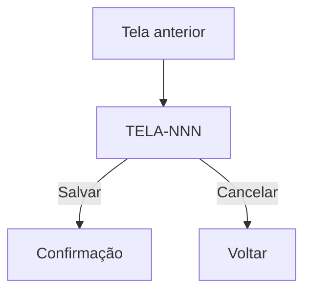

---
name: discovery-14-Telas
description: Documenta UMA tela de UI por invocação, lendo TELA-CATALOGO.md para identificar número sequencial e arquivo legado. PRÉ-REQUISITO: executar discovery-14-telas-catalogo primeiro. Gera TELA-{NNN}-{PascalCase}.md e atualiza o status no catálogo.
---

# Skill — discovery-14-Telas

**Propósito:** Documentar uma tela de UI de forma completa e rastreável, gerando o artefato `TELA-{NNN}-{PascalCase}.md`.

Esta skill processa **uma tela por invocação**. Use o CLI para invocar em lote.

> **Pré-requisito:** `TELA-CATALOGO.md` deve existir. Se ainda não foi gerado, execute a skill `discovery-14-telas-catalogo` primeiro.

---

## 1. Pré-leitura obrigatória

Ler na ordem abaixo antes de qualquer outra ação:

1. **`discovery-project.yml`** → obter `paths.legacy` e `paths.discovery`
2. **`{paths.discovery}/TELA-CATALOGO.md`** → localizar a tela solicitada (por nome ou número) para obter:
   - Número sequencial (NNN)
   - Nome PascalCase
   - Caminho do arquivo legado
   - Tipo (PRINCIPAL / AUXILIAR / SEM-FLUXO)
3. Se existirem, ler os artefatos de discovery para enriquecer a documentação:
   - **`discovery/DADOS-10-ROTINAS-FUNCTIONS-PROCEDURES.md`** → fichas de functions/procedures relacionadas à tela (fonte de verdade de RN-SP-*)
   - **`discovery/DADOS-05-MAPA-DADOS.md`** → catálogo de tabelas e colunas para rastreabilidade de campos
   - **`discovery/DADOS-06-STATUS-E-TRANSICOES.md`** → mapa de status e transições de estado visíveis na tela

---

## 2. Nomenclatura e localização do artefato

| Elemento | Regra |
|---|---|
| **Formato do nome** | `TELA-{NNN}-{PascalCase}.md` |
| **Número (NNN)** | 3 dígitos, conforme atribuído em `TELA-CATALOGO.md` |
| **PascalCase** | Slug derivado do arquivo legado (conforme gerado pelo catalogador) |
| **Perfil SEM-FLUXO** | Sufixo no nome: `TELA-{NNN}-{PascalCase}-SEM-FLUXO.md` |
| **Pasta de saída** | `{paths.discovery}/` (raiz da pasta de discovery) |

Exemplos:
- `TELA-001-CadastroContribuinte.md`
- `TELA-042-ConsultaHistoricoPA.md`
- `TELA-007-RelatorioMensal-SEM-FLUXO.md`

---

## 3. Atualização de status no catálogo

**Antes de iniciar** a documentação: atualizar o status da tela em `TELA-CATALOGO.md` para **🟡 em andamento**.

**Ao concluir** a geração do arquivo: atualizar o status para **🟢 documentada** e preencher o campo `Artefato gerado`.

---

## 4. Investigação técnica obrigatória

Antes de redigir, investigar a cadeia técnica completa da tela:

1. **View legada** (`*.xhtml` / `*.jsp`): campos, labels, eventos, chamadas AJAX, mensagens de validação
2. **Java associado** (Action/Bean/MB/Controller com mesmo nome base): métodos, fluxos de navegação, validações server-side, chamadas a EJBs/SPs
3. **Tabelas e colunas** (`DADOS-05`): quais entidades a tela persiste ou consulta
4. **Functions e procedures** (`DADOS-10`): regras embutidas em SQL que afetam a tela
5. **Transições de status** (`DADOS-06`): ciclos de vida visíveis na tela
6. **Perfis de acesso**: verificar `DISC-02-PERFIS-PERMISSOES.md` se existir; caso contrário, inferir das anotações de segurança Java (`@RolesAllowed`, `@Restrict`, etc.)

---

## 5. Template do artefato gerado

O arquivo `TELA-{NNN}-{PascalCase}.md` deve conter as seções abaixo. Seções não aplicáveis ao perfil (AUXILIAR, SEM-FLUXO) devem ser marcadas como N/A, mas não omitidas.

---

### Cabeçalho obrigatório

```markdown
# TELA-{NNN} — {Nome PascalCase}

| Campo | Valor |
|---|---|
| **ID** | TELA-{NNN} |
| **Nome** | {Nome legível} |
| **Perfil** | PRINCIPAL / AUXILIAR / SEM-FLUXO |
| **Arquivo legado** | `{caminho/nome-arquivo.xhtml}` |
| **Java associado** | `{caminho/NomeBean.java}` |
| **Módulo** | {Derivado automaticamente do caminho legado; ex: Atendimento, Arrecadação, Cadastro Básico} |
| **Versão** | 1.0.0 |
| **Data** | DD/MM/AAAA |
| **Status** | 🟢 documentada |
```

---

### Seção 1 — Objetivo e contexto

Descrever:
- O que a tela faz (em linguagem de negócio, sem jargão técnico)
- Quando é acessada no fluxo geral do sistema
- Qual problema do usuário ela resolve

---

### Seção 2 — Atores e perfis de acesso

| Perfil | Ações permitidas |
|---|---|
| {Perfil} | {Descrever ações} |

Fonte: `DISC-02-PERFIS-PERMISSOES.md` ou inferido das anotações de segurança Java.

---

### Seção 3 — Campos, tipos e validações

| Campo | Label na tela | Tipo | Obrigatório | Validações | Observações |
|---|---|---|---|---|---|
| {nome_campo} | {Label} | Texto / Número / Data / Select / … | Sim/Não | {regras} | {obs} |

Incluir todas as mensagens de validação exibidas ao usuário.

---

### Seção 4 — Regras de negócio (RN)

Listar regras identificadas na investigação. Prefixar com `RN-{NNN}-{seq}`:

| ID | Enunciado | Origem |
|---|---|---|
| RN-001-01 | {Regra em linguagem de negócio} | Código Java / SP / Regra de UI |

Incluir obrigatoriamente regras derivadas de filtros SQL da `DADOS-10` (ex.: "somente registros ativos são retornados").

---

### Seção 5 — Fluxo de navegação

Descrever:
- **Entrada:** de onde o usuário chega a esta tela (URL, link, redirecionamento)
- **Ações disponíveis:** botões, links, ações AJAX
- **Saída:** para onde cada ação leva (próxima tela, mensagem, permanece)

Usar diagrama Mermaid quando o fluxo tiver mais de 3 caminhos:



---

### Seção 6 — Mensagens e erros

| Código / ID | Mensagem exibida | Gatilho | Criticidade |
|---|---|---|---|
| MSG-001 | {Texto da mensagem} | {Quando ocorre} | Erro / Aviso / Info |

---

### Seção 7 — Wireframe

> Wireframe obrigatório. Preferir imagem quando disponível; usar ASCII como fallback.

```
┌─────────────────────────────────────────┐
│ TELA-{NNN} — {Nome}                     │
├─────────────────────────────────────────┤
│ [Campo 1: ____________]                 │
│ [Campo 2: ____________]                 │
│                                         │
│ [Salvar]  [Cancelar]                    │
└─────────────────────────────────────────┘
```

---

### Seção 8 — Critérios de aceitação (Gherkin)

```gherkin
Funcionalidade: {Nome da tela}

  Cenário: {Fluxo principal feliz}
    Dado que {pré-condição}
    Quando {ação do usuário}
    Então {resultado esperado}

  Cenário: {Validação negativa}
    Dado que {pré-condição}
    Quando {ação inválida}
    Então {mensagem de erro esperada}
```

Incluir cenários negativos: dados inválidos, falta de permissão, limites de campo.

---

### Seção 9 — Requisitos não funcionais

NFRs mensuráveis e verificáveis. Exemplos:
- Tempo de resposta ao submeter o formulário: ≤ X ms para 95% das requisições sob carga normal.
- Campos sensíveis mascarados na exibição.

---

### Seção 10 — Artefatos relacionados

| Artefato | Relação |
|---|---|
| `FLUXO-F{NNN}-*.md` | Fluxo que usa esta tela |
| `DADOS-05-MAPA-DADOS.md` | Tabelas/colunas usadas |
| `DADOS-10-ROTINAS-FUNCTIONS-PROCEDURES.md` | SPs/functions relacionadas |
| `TELA-CATALOGO.md` | Índice mestre de telas |
| `TELA-{NNN}-*.md` | Telas anteriores/posteriores no fluxo |

---

### Seção 11 — Histórico de alterações

| Data | Autor | Versão | Alteração |
|---|---|---|---|
| DD/MM/AAAA | {Autor} | 1.0.0 | Criação do documento |

### Esclarecimentos

- **Premissas:**
- **Dúvidas pendentes:**
- **Decisões tomadas:**

---

## 6. Checklist de entrega

- [ ] `TELA-CATALOGO.md` lido — número sequencial e arquivo legado identificados.
- [ ] Status atualizado para 🟡 em andamento antes de iniciar.
- [ ] View legada (xhtml/jsp) investigada: campos, labels, eventos, mensagens.
- [ ] Java associado investigado: métodos, navegação, validações server-side.
- [ ] `DADOS-10` consultado: fichas de SPs/functions relacionadas à tela.
- [ ] `DADOS-05` consultado: tabelas e colunas rastreadas.
- [ ] `DADOS-06` consultado: ciclos de vida e transições de status.
- [ ] Perfis de acesso identificados.
- [ ] **Módulo preenchido** (derivado automaticamente do caminho legado; ex: Atendimento, Arrecadação, Cadastro Básico).
- [ ] Nomenclatura correta: `TELA-{NNN}-{PascalCase}.md` (ou `-SEM-FLUXO` quando aplicável).
- [ ] Seções 1–11 preenchidas (N/A quando não aplicável, mas presentes).
- [ ] Wireframe ASCII incluído (ou imagem referenciada).
- [ ] Gherkin com cenário positivo + ao menos 1 negativo.
- [ ] NFRs mensuráveis.
- [ ] Seção 10 (Artefatos relacionados) completa.
- [ ] Versão 1.0.0 e data no cabeçalho.
- [ ] Status atualizado para 🟢 documentada no `TELA-CATALOGO.md`.
