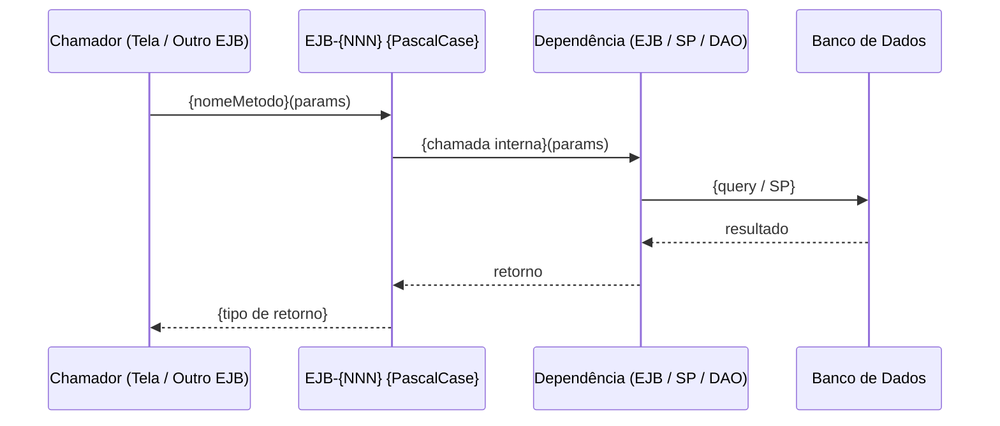

# Skill — discovery-51-ejb

**Propósito:** Documentar um Session Bean EJB de forma completa e rastreável, gerando o artefato `EJB-{NNN}-{PascalCase}.md`.

Esta skill processa **um EJB por invocação**. Use o catálogo para invocar em lote.

> **Pré-requisito:** `EJB-CATALOGO.md` deve existir. Se ainda não foi gerado, execute a skill `discovery-50-catalogo-ejb` primeiro.

---

## 1. Pré-leitura obrigatória

Ler na ordem abaixo antes de qualquer outra ação:

1. **`discovery-project.yml`** → obter `paths.legado` e `paths.discovery`
2. **`{paths.discovery}/EJB-CATALOGO.md`** → localizar o EJB solicitado (por nome ou número) para obter:
   - Número sequencial (NNN)
   - Nome PascalCase
   - Caminho do arquivo legado
   - Caminho da interface Local/Remote (se existir)
   - Tipo (Stateless / Stateful)
3. Se existirem, ler os artefatos de discovery para enriquecer a documentação:
   - **`{paths.discovery}/DADOS-10-ROTINAS-FUNCTIONS-PROCEDURES.md`** → fichas de functions/procedures chamadas por este EJB (fonte de verdade de RN-SP-*)
   - **`{paths.discovery}/DADOS-05-MAPA-DADOS.md`** → catálogo de tabelas e colunas para rastreabilidade de campos
   - **`{paths.discovery}/DADOS-06-STATUS-E-TRANSICOES.md`** → mapa de status e transições gerenciadas pelo EJB

---

## 2. Nomenclatura e localização do artefato

| Elemento | Regra |
|---|---|
| **Formato do nome** | `EJB-{NNN}-{PascalCase}.md` |
| **Número (NNN)** | 3 dígitos, conforme atribuído em `EJB-CATALOGO.md` |
| **PascalCase** | Slug derivado do arquivo legado (conforme gerado pelo catalogador) |
| **Pasta de saída** | `{paths.discovery}/` (raiz da pasta de discovery) |

Exemplos:
- `EJB-001-CalculoContribuicao.md`
- `EJB-042-GestaoParcelamento.md`
- `EJB-007-ProcessamentoBeneficio.md`

---

## 3. Atualização de status no catálogo

**Antes de iniciar** a documentação: atualizar o status do EJB em `EJB-CATALOGO.md` para **🟡 em andamento**.

**Ao concluir** a geração do arquivo: atualizar o status para **🟢 documentado** e preencher o campo `Artefato gerado`.

---

## 4. Investigação técnica obrigatória

Antes de redigir, investigar a cadeia técnica completa do EJB:

1. **Arquivo EJB** (`*Bean.java` / `*Impl.java`): anotações, métodos, lógica de negócio, injeções (`@EJB`, `@In`, `@PersistenceContext`)
2. **Interface associada** (`*Local.java` / `*Remote.java`): contrato público — assinaturas dos métodos expostos
3. **EJBs injetados**: dependências de outros Session Beans invocados internamente
4. **SPs e Functions chamadas**: buscar fichas em `DADOS-10` — **não reler o SQL quando a ficha existir**; as regras de negócio já estão documentadas como RN-SP-*
5. **Tabelas e colunas** (`DADOS-05`): entidades persistidas ou consultadas via HQL, Criteria ou JDBC
6. **Transições de status** (`DADOS-06`): ciclos de vida gerenciados ou disparados pelo EJB
7. **Perfis de acesso**: anotações `@RolesAllowed`, Seam `@Restrict`, regras em `security.drl`
8. **Quem chama este EJB**: busca reversa no legado — quais telas (Actions/MBs), outros EJBs ou jobs invocam este serviço

---

## 5. Template do artefato gerado

O arquivo `EJB-{NNN}-{PascalCase}.md` deve conter as seções abaixo. Seções não aplicáveis devem ser marcadas como `N/A`, mas **não omitidas**.

---

### Cabeçalho obrigatório

```markdown
# EJB-{NNN} — {Nome PascalCase}

| Campo | Valor |
|---|---|
| **ID** | EJB-{NNN} |
| **Nome** | {Nome legível} |
| **Tipo** | Stateless / Stateful |
| **Arquivo legado** | `{caminho/NomeBean.java}` |
| **Interface** | `{caminho/NomeLocal.java}` ou — se inexistente |
| **Módulo** | {Previdenciario-ejb / outro} |
| **Versão** | 1.0.0 |
| **Data** | DD/MM/AAAA |
| **Status** | 🟢 documentado |
```

---

### Seção 1 — Objetivo e contexto

Descrever:
- O que este EJB faz (em linguagem de negócio, sem jargão técnico)
- Quando é invocado no fluxo geral do sistema
- Qual problema de negócio ele resolve
- Enriquecer com a interpretação de negócio das fichas de DADOS-10 quando existirem

---

### Seção 2 — Perfis de acesso

| Perfil | Métodos acessíveis | Restrição |
|---|---|---|
| {Perfil} | {lista de métodos} | `@RolesAllowed` / `@Restrict` / security.drl |

Fonte: anotações de segurança Java (`@RolesAllowed`, Seam `@Restrict`) ou `security.drl`.
Quando não houver restrição explícita, registrar: _"Sem controle de acesso declarado neste EJB — herdado do chamador."_

---

### Seção 3 — Métodos públicos

| Método | Parâmetros | Retorno | Transação | Descrição em linguagem de negócio |
|---|---|---|---|---|
| `{nomeMetodo}` | `{tipo param1}, {tipo param2}` | `{tipo}` | `REQUIRED` / `NOT_SUPPORTED` / … | {O que este método faz para o usuário} |

Incluir todos os métodos públicos declarados na interface ou na classe, exceto `equals`, `hashCode`, `toString`.
Indicar a anotação `@TransactionAttribute` quando presente; caso omitida, assumir `REQUIRED` (padrão EJB3).

---

### Seção 4 — Regras de negócio (RN)

Listar todas as regras identificadas na investigação. Prefixar com `RN-EJB-{NNN}-{seq}` para regras de código Java. Incorporar regras de SPs como `RN-SP-*` com referência ao DADOS-10:

| ID | Enunciado | Origem |
|---|---|---|
| RN-EJB-001-01 | {Regra em linguagem de negócio extraída do código Java} | Código Java |
| RN-SP-XXX-01 | {Regra extraída da ficha de SP em DADOS-10} | DADOS-10 / SP `{nome_sp}` |

Incluir obrigatoriamente:
- Validações de campos de entrada (pré-condições dos métodos)
- Regras de negócio embutidas em IFs e lógica condicional
- Regras derivadas de filtros SQL documentadas nas fichas de SPs do DADOS-10

---

### Seção 5 — Dependências técnicas

| Dependência | Tipo | Como é usada |
|---|---|---|
| `{NomeEJB}` | EJB injetado (`@EJB` / `@In`) | {Para que é chamado} |
| `{nome_sp}` | Stored Procedure / Function | {Via JDBC/JPA nativo — ver ficha em DADOS-10} |
| `{TABELA}` | Tabela (DADOS-05) | {Leitura / Escrita / Ambos} |
| `{NomeDao}` | DAO / Repository | {Operações de persistência delegadas} |

---

### Seção 6 — Diagrama de sequência

Obrigatório quando o EJB possui mais de 2 dependências ou mais de 1 método relevante.
Representar o método principal (ou os 2 mais importantes para o negócio).



---

### Seção 7 — Tratamento de erros e exceções

| Exceção | Condição de disparo | Tipo | Efeito na transação |
|---|---|---|---|
| `{NomeException}` | {Quando ocorre} | Application / System | Rollback / Sem rollback |

Incluir:
- Exceções lançadas explicitamente (`throw new ...`)
- Comportamento de rollback (`@ApplicationException(rollback=true)`)
- Mensagens propagadas ao chamador

---

### Seção 8 — Critérios de aceitação (Gherkin)

```gherkin
Funcionalidade: {Nome do EJB — em linguagem de negócio}

  Cenário: {Método principal — fluxo feliz}
    Dado que {pré-condição de negócio}
    Quando {método é invocado com dados válidos}
    Então {resultado esperado de negócio}

  Cenário: {Validação negativa — dado inválido ou permissão}
    Dado que {pré-condição}
    Quando {método é invocado com dado inválido ou sem permissão}
    Então {exceção lançada ou resultado de erro esperado}
```

Incluir:
- 1 cenário happy path por método relevante
- Ao menos 1 cenário negativo (dado inválido, falta de permissão, entidade não encontrada)
- Cenários de rollback quando o EJB gerencia transações críticas

---

### Seção 9 — Requisitos não funcionais

NFRs mensuráveis e verificáveis. Exemplos:
- Transacionalidade: todos os métodos de escrita devem ser executados em transação `REQUIRED`; falha deve causar rollback total.
- Thread-safety: EJBs `@Stateless` são thread-safe por contrato do container; EJBs `@Stateful` são **não** thread-safe — documentar se houver acesso concorrente.
- Latência: métodos de cálculo críticos devem responder em ≤ X ms para 95% das chamadas.
- Timeout: EJBs `@Stateful` devem declarar `@StatefulTimeout` quando gerenciam conversação longa.

---

### Seção 10 — Artefatos relacionados

| Artefato | Relação |
|---|---|
| `EJB-CATALOGO.md` | Índice mestre de EJBs |
| `TELA-{NNN}-*.md` | Telas que invocam este EJB |
| `FLUXO-F{NNN}-*.md` | Fluxos que orquestram este EJB |
| `DADOS-05-MAPA-DADOS.md` | Tabelas/colunas utilizadas |
| `DADOS-10-ROTINAS-FUNCTIONS-PROCEDURES.md` | SPs/functions chamadas |
| `EJB-{NNN}-*.md` | Outros EJBs injetados como dependência |

---

### Seção 11 — Histórico de alterações

| Data | Autor | Versão | Alteração |
|---|---|---|---|
| DD/MM/AAAA | {Autor} | 1.0.0 | Criação do documento |

### Esclarecimentos

- **Premissas:**
- **Dúvidas pendentes:**
- **Decisões tomadas:**

---

## 6. Checklist de entrega

- [ ] `EJB-CATALOGO.md` lido — número sequencial e arquivo legado identificados.
- [ ] Status atualizado para 🟡 em andamento antes de iniciar.
- [ ] Arquivo EJB investigado: anotações, métodos, lógica, injeções.
- [ ] Interface Local/Remote investigada: contrato público documentado.
- [ ] EJBs injetados identificados e listados na Seção 5.
- [ ] `DADOS-10` consultado: fichas de SPs/functions relacionadas; RN-SP-* incorporadas.
- [ ] `DADOS-05` consultado: tabelas e colunas rastreadas.
- [ ] `DADOS-06` consultado: transições de status gerenciadas pelo EJB.
- [ ] Perfis de acesso identificados (anotações de segurança ou ausência documentada).
- [ ] Busca reversa executada: telas e EJBs que chamam este serviço identificados.
- [ ] Nomenclatura correta: `EJB-{NNN}-{PascalCase}.md`.
- [ ] Seções 1–11 preenchidas (N/A quando não aplicável, mas presentes).
- [ ] Diagrama Mermaid incluído quando houver ≥ 2 dependências.
- [ ] Gherkin com cenário positivo + ao menos 1 negativo.
- [ ] NFRs mensuráveis (transacionalidade, thread-safety, latência).
- [ ] Seção 10 (Artefatos relacionados) completa.
- [ ] Versão 1.0.0 e data no cabeçalho.
- [ ] Status atualizado para 🟢 documentado no `EJB-CATALOGO.md`.
