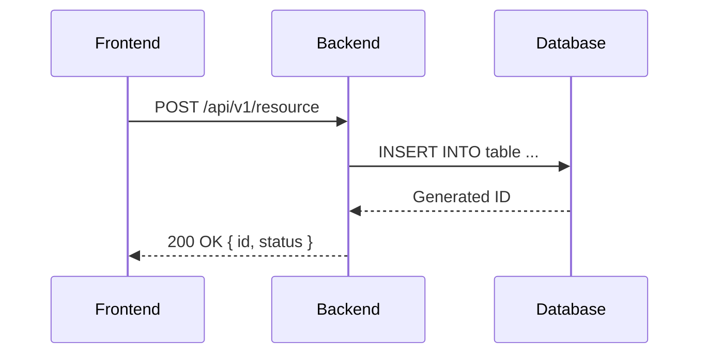

# API Documentation

Every API document must be created in the directory `documentacao/processo_unificado/artefatos_aprovados/documentacao_api/` with the `api-` prefix.

**Filename:** `api-api_name.md`

---

## Mandatory Minimum Content

1. **Endpoint purpose:** what it does and which problem it solves.
2. **Authentication/authorization:** type (Bearer, API Key, OAuth), required scopes and permissions.
3. **Input contract (request):** HTTP method, path, headers, query params, and body — with examples.
4. **Output contract (response):** structure, types, and examples for each relevant HTTP code.
5. **Field validations:** business and technical rules applied to each field.
6. **Masks and formats:** describe expected formats (CPF, CNPJ, ZIP code, phone, dates), examples, and reference to validations/regex or code that applies the mask.
7. **Error table and HTTP codes:** code, message, and cause.
8. **Usage scenario:** narrative flow of endpoint usage.
9. **Sequence diagram (Mermaid):** interactions between frontend, backend, and database.
10. **Related artifacts and impacts:** requirements, other endpoints, diagrams, and impacted documents.
11. **Change history** and **clarifications** at the end of the document (see the complete template in `documentacao/processo_unificado/artefatos_aprovados/documentacao_api/api-template.md`).

---

## API Document Template

```markdown
# API: [API Name]

| Field  | Value                                                                                     |
| ------ | ----------------------------------------------------------------------------------------- |
| Version | 1.0.0                                                                                     |
| Date   | DD/MM/YYYY                                                                                |
| Author | [Full name of the responsible person — "AI", "Copilot", "Automated" or similar is prohibited] |
| Status | draft / in review / approved                                                              |

## Purpose

[Describe what the endpoint does and which business problem it solves.]

## Authentication

- Type: Bearer Token / API Key / OAuth 2.0
- Required scope: `scope.name`

## Request

**Method:** `POST`
**Path:** `/api/v1/resource`

### Headers

| Header          | Required | Description        |
| --------------- | -------- | ------------------ |
| `Authorization` | Yes      | Bearer {token}     |
| `Content-Type`  | Yes      | application/json   |

### Body (request)

```json
{
  "field1": "example_value",
  "field2": 123
}
```

### Request field dictionary

| Field  | Path     | Type    | Length | Required | Mask/Format | Description          |
| ------ | -------- | ------- | ------ | -------- | ----------- | -------------------- |
| field1 | $.field1 | string  | 255    | Yes      | —           | Field description    |
| field2 | $.field2 | integer | —      | No       | —           | Field description    |

## Response

### 200 — Success

```json
{
  "id": 1,
  "status": "created"
}
```

### Error table

| HTTP Code | Internal Code | Message                    | Cause                               |
| --------- | ------------- | -------------------------- | ----------------------------------- |
| 400       | ERR_001       | Required field missing     | field1 not provided                 |
| 401       | ERR_002       | Invalid or expired token   | Token missing or malformed          |
| 422       | ERR_003       | Invalid format             | field1 outside expected pattern     |
| 500       | ERR_500       | Internal error             | Unexpected processing failure       |

## Sequence diagram



## Usage scenario

[Describe in prose the complete usage flow: who calls it, when, with what data, and what is expected to be received.]

## Related artifacts

- Requirements that impact this API:
- Requirements impacted by this API:
- Related technical documents (diagrams, data dictionary, procedures):

[history and clarifications — see template/ folder]

```

---

## Best Practices for API Documentation

- Include **real (or masked) examples** of request and response.
- Document **all possible error codes**, not just the happy path.
- Clearly indicate **fields with special masks or formats** and the regex or library that validates them.
- When documenting endpoints that call SQL procedures, include cross-reference with the database artifact.
- Keep the sequence diagram **up to date** with every contract change.
