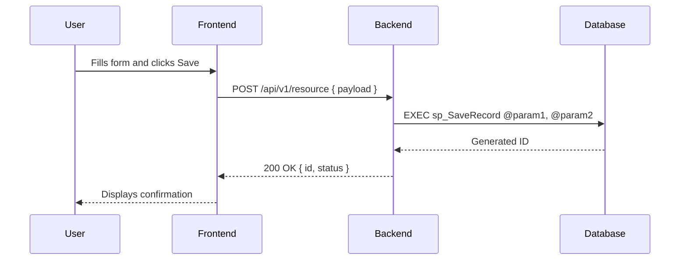
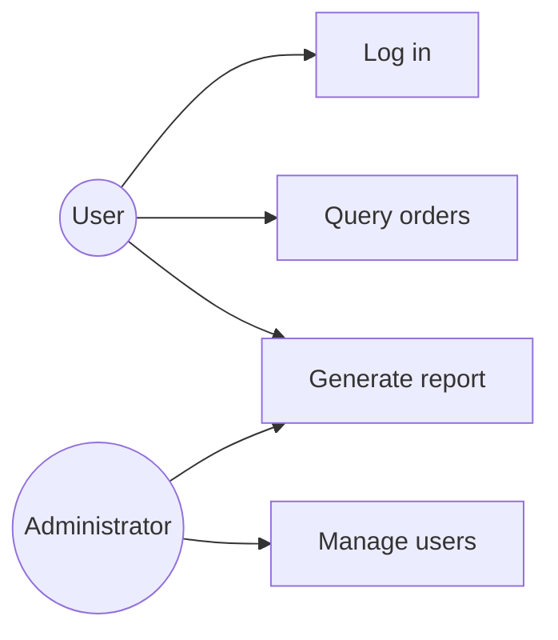
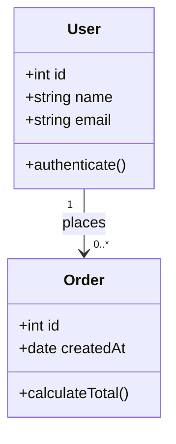
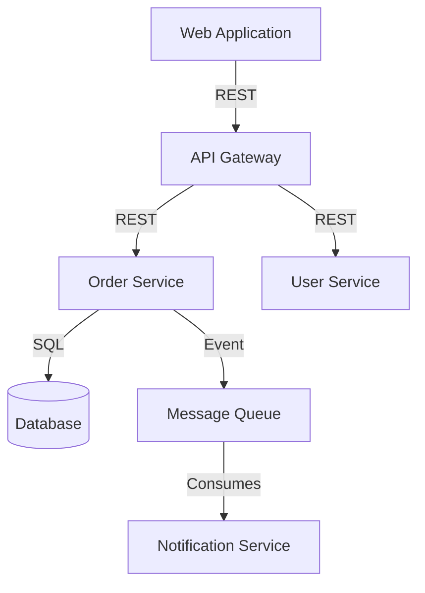
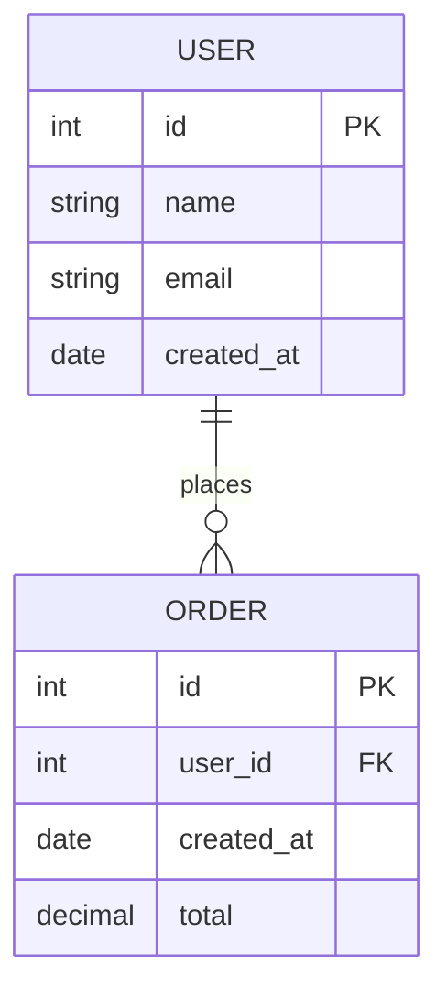
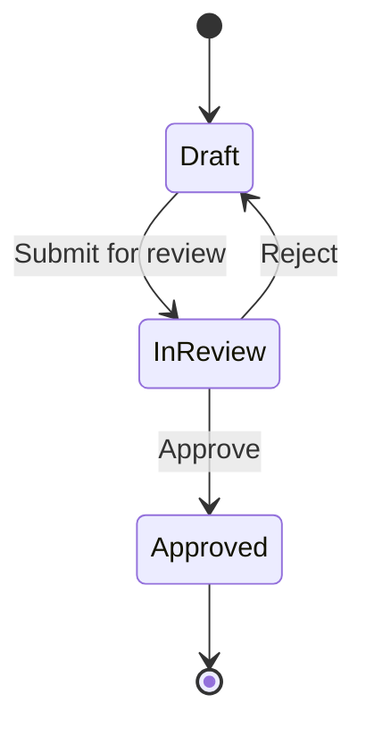

# Diagrams and Visualization

Use diagrams whenever text alone is insufficient to eliminate interpretation ambiguity.

All diagrams are created in **Mermaid.js** and stored in the corresponding type directories within `documentacao/processo_unificado/artefatos_aprovados/`, as defined in `estrutura.md`.

---

## Diagram types and when to use them

### Sequence Diagram

**Prefix:** none (embedded in the requirement or API document)
**Usage:** display interactions between components over time — ideal for API flows, authentication, asynchronous processes.

---

### Use Case Diagram

**Usage:** show system boundaries, actors, and their high-level interactions.

---

### Class Diagram (`dcl-`)

**File:** `documentacao/processo_unificado/artefatos_aprovados/diagrama_de_classes/dcl-diagram_name.md`
**Usage:** model code structure, attributes, methods, and relationships between classes.

---

### System Integration Diagram (`min-`)

**File:** `documentacao/processo_unificado/artefatos_aprovados/diagrama_de_integracao_de_sistemas/min-diagram_name.md`
**Usage:** map data flow between systems, services, and external integrations.

---

### Entity Relationship Diagram (`der-`)

**File:** `documentacao/processo_unificado/artefatos_aprovados/diagrama_de_entidades_e_relacionamento/der-diagram_name.md`
**Usage:** document the data model, entities, attributes, and relationships.

---

### Flow / State Diagram

**Usage:** represent navigation logic, entity states, or flow decisions.

---

## Usage Guidelines

- Prefer Mermaid.js for all diagrams — keeps documentation versionable alongside the code.
- Use ASCII Mermaid as a fallback only when the tool does not support rendering.
- **Every diagram must have a title and brief description** explaining what it represents.
- Validate Mermaid syntax before finalizing the document.
- Sequence diagrams are **mandatory** in API documents and in requirements describing multi-layer flows.
- ERD and Class diagrams are **mandatory** when the functionality involves a relevant data model.
