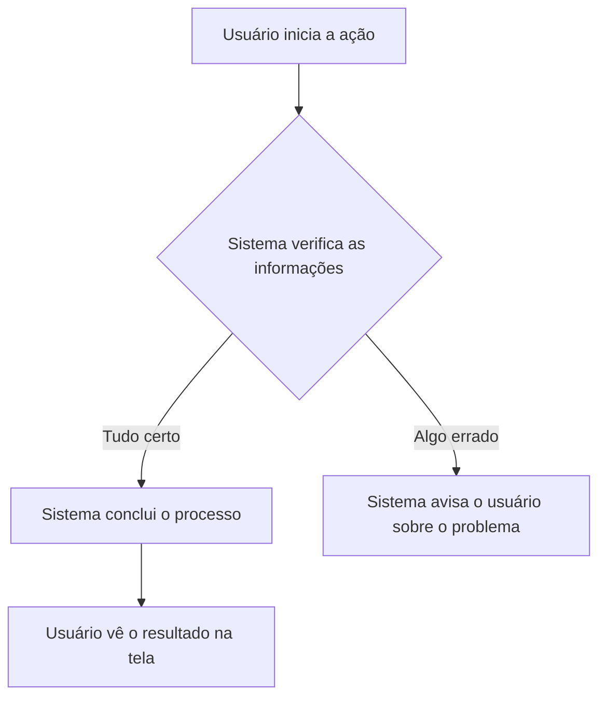

# [Título do Requisito — em português, claro e direto]

## Metadados

| Campo               | Valor                                              |
| ------------------- | -------------------------------------------------- |
| Código do documento | req-XXXX                                           |
| Título              | Título descritivo do requisito                     |
| Data de criação     | DD/MM/AAAA                                         |
| Última atualização  | DD/MM/AAAA                                         |
| Autor               | Nome completo do autor (proibido "IA"/"Copilot")   |
| Versão              | 1.0.0                                              |
| Status              | Rascunho / Em revisão / Aprovado                   |

> **Regra de idioma:** todo o conteúdo deste documento deve ser escrito em **português brasileiro (pt-BR)**. É terminantemente proibido o uso de termos em inglês (ex: endpoint, payload, cache), nomes de arquivos, nomes de classes, métodos, endpoints, rotas, tabelas, colunas ou qualquer outro jargão técnico. A linguagem deve ser compreensível por qualquer pessoa sem conhecimento em tecnologia.
> **Correção Automática:** Durante qualquer atualização deste documento, qualquer termo que viole a regra de idioma ou a clareza para stakeholders não técnicos será **automaticamente corrigido** pelo agente para garantir a conformidade inegociável do artefato.

## Objetivo

Explique de forma simples o propósito deste requisito: qual necessidade de negócio ele atende e qual problema ele resolve. Use uma linguagem que qualquer pessoa leiga em tecnologia entenda.

## Escopo

### O que este requisito faz

- Liste aqui o que está contemplado, em itens simples e diretos

### O que este requisito não faz

- Liste aqui os limites do que não será tratado, para evitar expectativas incorretas

## Para quem este requisito foi feito

Descreva o perfil das pessoas que vão usar esta funcionalidade no dia a dia. Exemplos: "atendentes de call center", "gerentes de loja", "clientes finais do aplicativo". Explique como elas se beneficiam.

## Descrição geral

### Contexto

Explique em parágrafos o cenário atual (como as coisas funcionam hoje) e por que uma mudança é necessária. Conte uma história — o leitor precisa entender o "antes" para valorizar o "depois".

### Como funciona passo a passo

Descreva em detalhes como a funcionalidade funciona do ponto de vista do usuário. Use parágrafos narrativos, não tópicos soltos. Cubra:

1. **O que o usuário faz primeiro** — a ação inicial
2. **O que o sistema mostra ou pergunta** — a resposta do sistema
3. **O que o usuário informa ou seleciona** — os dados de entrada
4. **O que o sistema processa** — o que acontece internamente (sem detalhes técnicos)
5. **O que o usuário vê ao final** — o resultado na tela

### O que acontece em caso de erro

Descreva o comportamento esperado quando algo não sai como planejado, em linguagem amigável. Exemplo: "Se o CPF informado for inválido, o sistema mostra uma mensagem em vermelho explicando o erro e pede para o usuário digitar novamente."

### Exemplo do dia a dia

Inclua um exemplo concreto com dados fictícios (nomes, valores, datas) que ilustre o uso da funcionalidade do começo ao fim. Isso ajuda pessoas não técnicas a visualizarem o funcionamento.

## Fluxo do funcionamento



> Este diagrama mostra o fluxo principal. Inclua diagramas adicionais para cada situação de erro ou fluxo alternativo relevante.

## Wireframe da interface

> **Importante:** Este documento deve conter a **imagem PNG** da interface. O wireframe ASCII deve ser incluído **apenas** quando a geração da imagem PNG não for possível (falha do agente `design-lead` ou do script de captura).


> Caminho da imagem: `documentacao/padrao_visual/wireframe/req-XXXX.png`

## Requisitos funcionais (RF)

> ⚠️ **ATENÇÃO — Numeração contínua global:** Antes de criar ou numerar qualquer RF, consulte o arquivo `regras/requisitos-funcionais.md` para descobrir o **próximo número disponível**. A numeração é **global e contínua em todo o projeto** — nunca reinicie a contagem dentro deste documento.

| ID      | Descrição                             |
| ------- | ------------------------------------- |
| RF-____ | Descreva o que o sistema deve fazer   |

## Regras de negócio (RN)

> ⚠️ **ATENÇÃO — Numeração contínua global:** Antes de criar ou numerar qualquer RN, consulte o arquivo `regras/regras-negocios.md` para descobrir o **próximo número disponível**. A numeração é **global e contínua em todo o projeto** — nunca reinicie a contagem dentro deste documento.

| ID      | Regra                                               |
| ------- | --------------------------------------------------- |
| RN-____ | Descreva a regra que o sistema deve seguir          |

## Critérios de aceitação (resumo)

> ⚠️ No máximo 5 cenários neste documento. O conjunto completo de todos os cenários possíveis está em `criterios/cri-req-XXXX-nome_do_requisito.md`.

```gherkin
Funcionalidade: Nome da funcionalidade
  Como um [perfil de usuário]
  Quero [realizar uma ação]
  Para [obter um benefício]

  Cenário: Fluxo principal
    Dado que ...
    Quando ...
    Então ...
```

## Riscos do requisito

| Risco                                                                 | Impacto (1-5) | Probabilidade (1-5) | O que fazer para evitar          |
| --------------------------------------------------------------------- | ------------- | ------------------- | -------------------------------- |
| Descreva o risco em linguagem simples, sem termos técnicos            | 1 a 5         | 1 a 5               | Descreva a medida de prevenção   |

## Rastreabilidade

| Item                   | Referência                                 |
| ---------------------- | ------------------------------------------ |
| Demanda / solicitação  |                                            |
| Documento técnico      | `tec/tec-req-XXXX-nome_do_requisito.md`    |
| Estimativa             | `estimativas/estimativa-req-XXXX-*.md`     |
| Critérios de aceitação | `criterios/cri-req-XXXX-nome_do_requisito.md` |

## Esclarecimentos

- Premissas consideradas:
- Dúvidas pendentes:
- Decisões tomadas:

## Histórico de alterações

| Data       | Autor | Versão | Alteração            |
| ---------- | ----- | ------ | -------------------- |
| DD/MM/AAAA | Nome  | 1.0.0  | Criação do documento |
