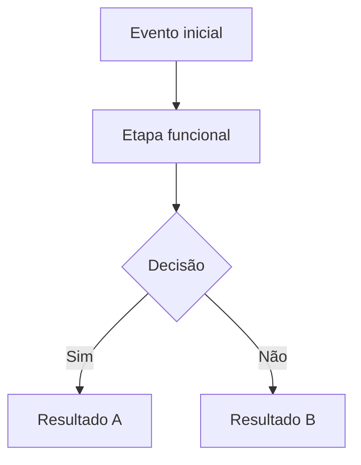
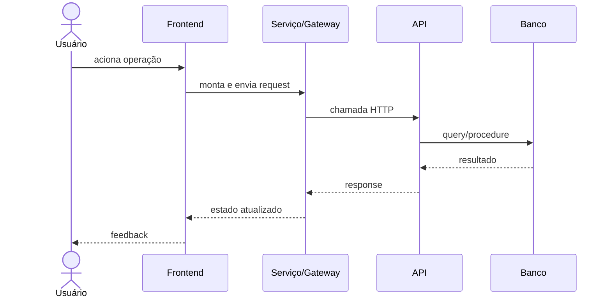

# Documento Técnico Completo — REQ-XXXX

## Metadados

- **Código do documento:** `TEC-REQ-XXXX`
- **Requisito vinculado:** `REQ-XXXX`
- **Título:** Implementação técnica de `<nome-da-funcionalidade>`
- **Data de criação:** DD/MM/AAAA
- **Última atualização:** DD/MM/AAAA
- **Autor:** Nome do autor
- **Versão:** 1.0.0
- **Status:** Rascunho | Em revisão | Aprovado

> Este template é **mínimo obrigatório** para `tec-req-XXXX` e deve ser preenchido de forma a contemplar, no mínimo, a junção do conteúdo de negócio (`req-XXXX`) com o conteúdo técnico de implementação.
> **Idioma obrigatório:** todo conteúdo descritivo deste documento deve ser escrito em português (pt-BR). Apenas identificadores técnicos reais podem permanecer no idioma original (ex.: nomes de função, método, arquivo, interface, classe, endpoint, rota, tabela, coluna, DTO e payload).

## 1. Objetivo técnico

Descrever, em nível implementável, como construir, validar, testar e manter a funcionalidade `<nome-da-funcionalidade>`, cobrindo frontend, backend, integrações, dados e critérios de aceite técnicos.

## 2. Visão funcional consolidada (junção com REQ)

### 2.1 Introdução funcional

- Problema de negócio:
- Usuário/ator principal:
- Gatilho:
- Resultado esperado:

### 2.2 Escopo

#### Dentro do escopo

- TBD

#### Fora do escopo

- TBD

### 2.3 Requisitos funcionais consolidados

| ID      | Descrição | Prioridade       | Origem no REQ |
| ------- | --------- | ---------------- | ------------- |
| RF-XXXX |           | Alta/Média/Baixa | `REQ-XXXX`    |

### 2.4 Regras de negócio consolidadas

| ID      | Regra | Origem no REQ | Implementação técnica associada |
| ------- | ----- | ------------- | ------------------------------- |
| RN-XXXX |       | `REQ-XXXX`    |                                 |

### 2.5 Fluxo funcional (Mermaid)



## 3. Arquitetura técnica da solução

### 3.1 Artefatos técnicos relacionados

- Frontend:
  - `frontend/src/...`
- Backend:
  - `src/...`
- Banco de dados:
  - Tabelas/views/procedures/functions/triggers/jobs
- Testes:
  - Unitários
  - Integração
  - E2E
- Documentação vinculada:
  - `req-XXXX-...md`
  - `apf/apf-req-XXXX.md`
  - `matriz-risco-sistema.md`

### 3.2 Componentes e responsabilidades

| Componente | Camada              | Responsabilidade | Entradas | Saídas |
| ---------- | ------------------- | ---------------- | -------- | ------ |
|            | Frontend/Backend/DB |                  |          |        |

### 3.3 Rotas de frontend

- `/rota-exemplo`
- `/rota-exemplo/editar/:id`

Permissões aplicadas:

- `data.permissions: ['<permissao>']`

### 3.4 Endpoints e contratos de API

#### Endpoints utilizados

- `GET /api/...`
- `POST /api/...`
- `PUT /api/...`
- `DELETE /api/...`

#### Contrato de request

```json
{
  "campoExemplo": "valor"
}
```

#### Contrato de response

```json
{
  "dados": []
}
```

#### Códigos de retorno e tratamento

| Código HTTP | Cenário                  | Ação da UI | Observação |
| ----------- | ------------------------ | ---------- | ---------- |
| 200/201     | Sucesso                  |            |            |
| 400         | Validação                |            |            |
| 401/403     | Autenticação/Autorização |            |            |
| 404         | Não encontrado           |            |            |
| 500         | Erro interno             |            |            |

### 3.5 Orientação de construção de chamadas de API

- Ordem recomendada de chamadas:
  1. Validar pré-condições locais.
  2. Montar payload no DTO/Model.
  3. Executar chamada via service/gateway.
  4. Tratar sucesso, erro funcional e erro técnico.
  5. Atualizar estado da tela e feedback ao usuário.

- Estratégia de validação de payload:
  - Sanitização de strings (`trim`, normalização quando aplicável).
  - Conversão de tipos (datas, booleanos, identificadores).
  - Remoção de campos nulos/irrelevantes conforme contrato.

## 4. Dados, queries e persistência

### 4.1 Dicionário técnico de campos

| Campo | Caminho (JSON path/tabela.coluna) | Tipo | Tamanho/Precisão | Obrigatório | Máscara/Formato | Origem de validação |
| ----- | --------------------------------- | ---- | ---------------- | ----------- | --------------- | ------------------- |
|       |                                   |      |                  | Sim/Não     |                 | Front/Back/DB       |

### 4.2 Modelo de dados relacionado

- Tabelas:
- Views:
- Procedures:
- Functions:
- Triggers:

### 4.3 Como construir queries (quando aplicável)

- Definir objetivo da query (consulta, inserção, atualização, exclusão).
- Mapear filtros obrigatórios e opcionais.
- Garantir parâmetros seguros e tipados.
- Definir paginação/ordenação quando necessário.
- Documentar impacto em índices, locks e custo esperado.

#### Exemplo de query parametrizada (modelo)

```sql
SELECT id, nome
FROM tabela_exemplo
WHERE (:nome IS NULL OR nome ILIKE '%' || :nome || '%')
ORDER BY nome
LIMIT :pageSize OFFSET :offset;
```

#### Exemplo de procedure/function (modelo)

```sql
CREATE OR REPLACE FUNCTION fn_exemplo(p_id uuid)
RETURNS TABLE(id uuid, nome text)
LANGUAGE sql
AS $$
    SELECT id, nome
    FROM tabela_exemplo
    WHERE id = p_id;
$$;
```

### 4.4 Fluxo técnico de operação (Mermaid)



## 5. UX, tela e wireframe técnico

> ⚠️ **Regra obrigatória:** Este documento (tec-req-XXXX) **deve** conter **ambos** — o wireframe ASCII (embedded nesta seção) **e** a imagem PNG (referenciada abaixo). Diferentemente do req-XXXX (que contém apenas a PNG), o tec-req-XXXX exige as duas representações.

### 5.1 Wireframe ASCII

```text
+------------------------------------------------------------+
| Título da funcionalidade                                     |
| ------------------------------------------------------------ |
| Filtros / ações                                              |
| ------------------------------------------------------------ |
| Conteúdo principal                                           |
| ------------------------------------------------------------ |
| Botões / paginação                                           |
+------------------------------------------------------------+
```

### 5.2 Imagem de referência (PNG)

> **Obrigatório:** A imagem PNG deve existir no caminho abaixo. Validar a existência do arquivo antes de finalizar o documento.
>
> Caminho padrão de imagem: `documentacao/padrao_visual/wireframe/req-XXXX.png`


### 5.3 Regras de interface e validações

- Regras de visibilidade por perfil/permissão:
- Regras de habilitação/desabilitação de ações:
- Mensagens de validação de campo:
- Mensagens de sucesso/erro:
- Regras de foco e navegação por teclado:

## 6. Validações técnicas completas

### 6.1 Frontend

- Campos obrigatórios:
- Máscaras:
- Validações síncronas:
- Validações assíncronas:

### 6.2 Backend

- Validações de contrato:
- Regras de autorização:
- Regras de consistência:

### 6.3 Banco de dados

- Constraints:
- Índices envolvidos:
- Regras transacionais:

## 7. Critérios de aceitação técnicos (Gherkin)

> ⚠️ **Máximo 5 cenários Gherkin neste documento.** O conjunto completo de todos os cenários possíveis deve estar em `criterios/cri-req-XXXX-nome_do_requisito.md`.

```gherkin
Funcionalidade: <nome-da-funcionalidade>
  Como desenvolvedor responsável pela entrega
  Quero implementar com regras técnicas explícitas
  Para garantir comportamento correto e rastreável

  Cenário: Fluxo principal com sucesso
    Dado que as pré-condições técnicas estão satisfeitas
    Quando a operação principal é executada
    Então a API deve responder com sucesso
    E os dados devem ser persistidos conforme o contrato

  Cenário: Falha de validação
    Dado um payload inválido
    Quando a API recebe a requisição
    Então deve retornar erro de validação
    E a interface deve exibir mensagem adequada
```

## 8. Requisitos não funcionais técnicos

| Categoria       | Requisito | Métrica | Método de validação |
| --------------- | --------- | ------- | ------------------- |
| Desempenho      |           |         |                     |
| Segurança       |           |         |                     |
| Confiabilidade  |           |         |                     |
| Observabilidade |           |         |                     |
| Acessibilidade  |           |         |                     |
| Reflow (320px)  |           |         |                     |

## 9. Testes e evidências

### 9.1 Testes unitários

- Arquivos:
- Cenários:

### 9.2 Testes de integração

- Endpoints cobertos:
- Contratos validados:

### 9.3 Testes E2E

- Fluxos críticos:
- Evidências:

### 9.4 Cobertura e qualidade

- Cobertura mínima esperada:
- Lint/análise estática:
- Checklist de regressão:

## 10. Riscos técnicos (recorte local)

| ID         | Risco | Impacto | Probabilidade | Score | Nível | Mitigação |
| ---------- | ----- | ------- | ------------- | ----- | ----- | --------- |
| RT-XXXX-01 |       |         |               |       |       |           |

## 11. Plano de implementação

### 11.1 Passo a passo técnico

1. TBD
2. TBD
3. TBD

### 11.2 Estratégia de rollback/contingência

- TBD

## 12. Rastreabilidade consolidada

| Item                   | Referência                             |
| ---------------------- | -------------------------------------- |
| Requisito de negócio   | `req-XXXX-...md`                       |
| APF                    | `apf/apf-req-XXXX.md`                  |
| Matriz de risco global | `documentacao/matriz-risco-sistema.md` |
| Código frontend        |                                        |
| Código backend         |                                        |
| Banco de dados         |                                        |
| Testes                 |                                        |

## 13. Checklist de completude do TEC-REQ

- [ ] Conteúdo funcional consolidado do `REQ-XXXX` foi incorporado neste documento.
- [ ] Fluxo funcional e fluxo técnico documentados em Mermaid.
- [ ] Rotas, endpoints, contratos e exemplos preenchidos.
- [ ] Estratégia de construção de queries/chamadas de API documentada.
- [ ] Dicionário técnico de campos completo (tipo, máscara, obrigatoriedade, origem da validação).
- [ ] Validações de frontend, backend e banco descritas.
- [ ] Critérios de aceitação técnicos em Gherkin preenchidos.
- [ ] NFRs técnicos com métricas objetivas preenchidos.
- [ ] Testes e evidências mapeados.
- [ ] Riscos técnicos e mitigações registrados.
- [ ] Referências cruzadas com `REQ`, `APF`, `cri-req` e matriz global atualizadas.

## 14. Histórico de alterações

> Formato obrigatório: tabela Markdown com colunas `Data | Autor | Versão | Alteração`.

| Data       | Autor | Versão | Alteração                                            |
| ---------- | ----- | ------ | ---------------------------------------------------- |
| DD/MM/AAAA | Nome  | 1.0.0  | Criação do template técnico completo `TEC-REQ-XXXX`. |

## 15. Esclarecimentos

- Premissas consideradas:
- Dúvidas pendentes:
- Decisões tomadas:
