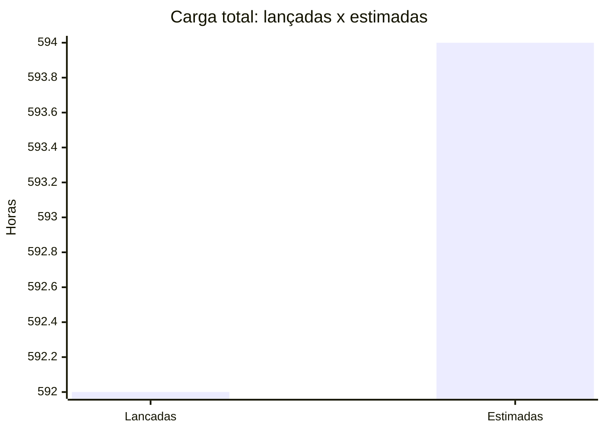
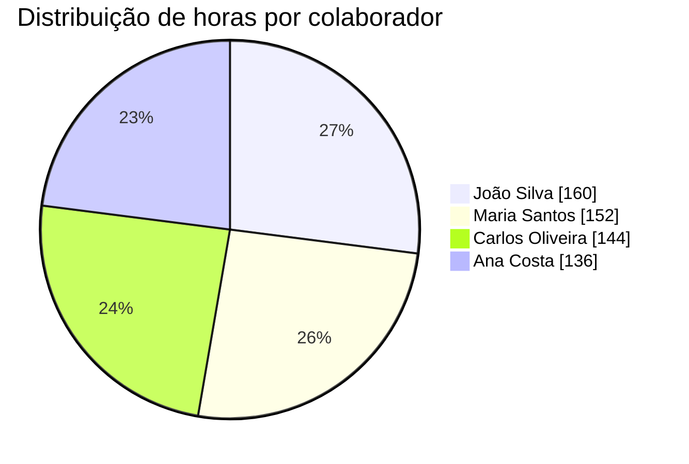
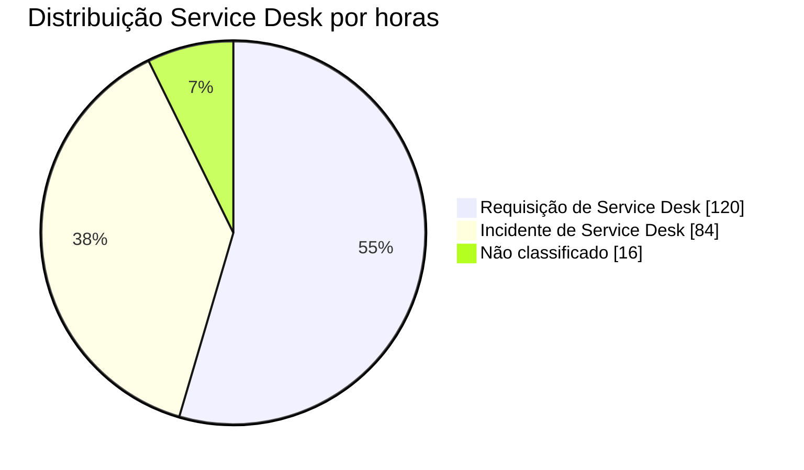
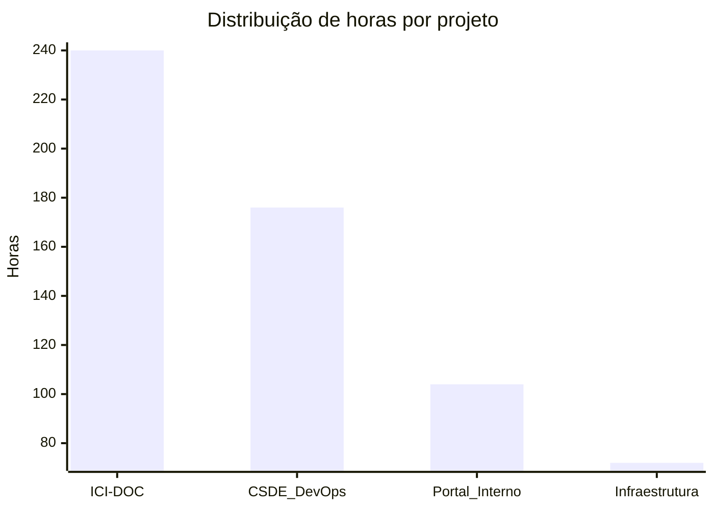

# Relatório de Atividades dos Desenvolvedores

**Período:** 01/03/2026 a 31/03/2026
**Projeto:** Todos
**Gerado em:** 27/04/2026 14:30

## Índice

- [1) Painel Executivo](#1-painel-executivo)
- [2) Carga Total e Distribuições](#2-carga-total-e-distribuições)
- [3) Colaboradores](#3-colaboradores)
- [4) Projetos](#4-projetos)
- [5) Tipos de Atividade](#5-tipos-de-atividade)
- [6) Projeto > Tipo > Colaborador (Subtabelas)](#6-projeto--tipo--colaborador-subtabelas)
- [7) Service Desk (Subtabelas)](#7-service-desk-subtabelas)
- [8) KPIs e Índices de Planejamento](#8-kpis-e-índices-de-planejamento)
- [9) Estatísticas para Planejamento](#9-estatísticas-para-planejamento)
- [10) Observações](#10-observações)

---

## 1) Painel Executivo

| Indicador Chave                      |   Valor |
| ------------------------------------ | ------: |
| Horas lançadas totais                | 592.00h |
| Horas estimadas totais               | 594.00h |
| Aderência estimativa                 |  99.66% |
| Colaboradores ativos                 |       4 |
| Projetos ativos                      |       4 |
| Classificações Service Desk mapeadas |       3 |

---

## 2) Carga Total e Distribuições

### 2.1 Carga total lançada x estimada

### 2.2 Distribuição de horas por colaborador

### 2.3 Distribuição de horas por classificação Service Desk

### 2.4 Distribuição de horas por projeto

---

## 3) Colaboradores

| Colaborador     | Horas Lançadas | Horas Estimadas | Delta (L-E) | Lançamentos |  % da Carga |
| --------------- | -------------: | --------------: | ----------: | ----------: | ----------: |
| João Silva      |         160.00 |          150.00 |       10.00 |          28 |      27.03% |
| Maria Santos    |         152.00 |          160.00 |       -8.00 |          25 |      25.68% |
| Carlos Oliveira |         144.00 |          144.00 |        0.00 |          22 |      24.32% |
| Ana Costa       |         136.00 |          140.00 |       -4.00 |          20 |      22.97% |
| **Total**       |     **592.00** |      **594.00** |   **-2.00** |      **95** | **100.00%** |

---

## 4) Projetos

| Projeto        | Horas Lançadas | Horas Estimadas | Delta (L-E) | Lançamentos |  % da Carga |
| -------------- | -------------: | --------------: | ----------: | ----------: | ----------: |
| ICI-DOC        |         240.00 |          235.00 |        5.00 |          38 |      40.54% |
| CSDE DevOps    |         176.00 |          180.00 |       -4.00 |          28 |      29.73% |
| Portal Interno |         104.00 |          104.00 |        0.00 |          16 |      17.57% |
| Infraestrutura |          72.00 |           75.00 |       -3.00 |          13 |      12.16% |
| **Total**      |     **592.00** |      **594.00** |   **-2.00** |      **95** | **100.00%** |

---

## 5) Tipos de Atividade

| Tipo de Atividade      | Horas Lançadas | Horas Estimadas | Delta (L-E) | Lançamentos |  % da Carga |
| ---------------------- | -------------: | --------------: | ----------: | ----------: | ----------: |
| Desenvolvimento        |         380.00 |          390.00 |      -10.00 |          62 |      64.19% |
| Análise e Planejamento |         120.00 |          120.00 |        0.00 |          18 |      20.27% |
| Testes                 |          60.00 |           60.00 |        0.00 |          10 |      10.14% |
| Documentação           |          24.00 |           20.00 |        4.00 |           3 |       4.05% |
| Administrativa         |           8.00 |            4.00 |        4.00 |           2 |       1.35% |
| **Total**              |     **592.00** |      **594.00** |   **-2.00** |      **95** | **100.00%** |

---

## 6) Projeto > Tipo > Colaborador (Subtabelas)

### 6.1 Projeto: ICI-DOC

#### 6.1.1 Tipo: Desenvolvimento

| Colaborador                              | Horas Lançadas | Horas Estimadas | Delta (L-E) | Lançamentos |
| ---------------------------------------- | -------------: | --------------: | ----------: | ----------: |
| João Silva                               |          88.00 |           85.00 |        3.00 |          14 |
| Maria Santos                             |          80.00 |           85.00 |       -5.00 |          12 |
| Carlos Oliveira                          |          40.00 |           40.00 |        0.00 |           6 |
| **Subtotal (ICI-DOC > Desenvolvimento)** |     **208.00** |      **210.00** |   **-2.00** |      **32** |

#### 6.1.2 Tipo: Análise e Planejamento

| Colaborador                                     | Horas Lançadas | Horas Estimadas | Delta (L-E) | Lançamentos |
| ----------------------------------------------- | -------------: | --------------: | ----------: | ----------: |
| Carlos Oliveira                                 |          40.00 |           40.00 |        0.00 |           6 |
| **Subtotal (ICI-DOC > Análise e Planejamento)** |      **40.00** |       **40.00** |    **0.00** |       **6** |

### 6.2 Projeto: CSDE DevOps

#### 6.2.1 Tipo: Desenvolvimento

| Colaborador                                  | Horas Lançadas | Horas Estimadas | Delta (L-E) | Lançamentos |
| -------------------------------------------- | -------------: | --------------: | ----------: | ----------: |
| Carlos Oliveira                              |          80.00 |           80.00 |        0.00 |          11 |
| Ana Costa                                    |          56.00 |           60.00 |       -4.00 |           9 |
| **Subtotal (CSDE DevOps > Desenvolvimento)** |     **136.00** |      **140.00** |   **-4.00** |      **20** |

#### 6.2.2 Tipo: Análise e Planejamento

| Colaborador                                         | Horas Lançadas | Horas Estimadas | Delta (L-E) | Lançamentos |
| --------------------------------------------------- | -------------: | --------------: | ----------: | ----------: |
| Maria Santos                                        |          40.00 |           40.00 |        0.00 |           8 |
| **Subtotal (CSDE DevOps > Análise e Planejamento)** |      **40.00** |       **40.00** |    **0.00** |       **8** |

---

## 7) Service Desk (Subtabelas)

### 7.1 Visão consolidada por classificação

| Classificação Service Desk | Horas Lançadas | Horas Estimadas | Delta (L-E) | Lançamentos |  % sobre SD |
| -------------------------- | -------------: | --------------: | ----------: | ----------: | ----------: |
| Requisição de Service Desk |         120.00 |          118.00 |        2.00 |          20 |      54.55% |
| Incidente de Service Desk  |          84.00 |           82.00 |        2.00 |          14 |      38.18% |
| Não classificado           |          16.00 |           14.00 |        2.00 |           3 |       7.27% |
| **Total SD**               |     **220.00** |      **214.00** |    **6.00** |      **37** | **100.00%** |

### 7.2 Projeto: ICI-DOC

#### 7.2.1 Tipo: Análise e Planejamento

| Colaborador                                     | Classificação Service Desk | Horas Lançadas | Horas Estimadas | Delta (L-E) | Lançamentos |
| ----------------------------------------------- | -------------------------- | -------------: | --------------: | ----------: | ----------: |
| Carlos Oliveira                                 | Requisição de Service Desk |          24.00 |           24.00 |        0.00 |           4 |
| **Subtotal (ICI-DOC > Análise e Planejamento)** | -                          |      **24.00** |       **24.00** |    **0.00** |       **4** |

#### 7.2.2 Tipo: Testes

| Colaborador                     | Classificação Service Desk | Horas Lançadas | Horas Estimadas | Delta (L-E) | Lançamentos |
| ------------------------------- | -------------------------- | -------------: | --------------: | ----------: | ----------: |
| Ana Costa                       | Incidente de Service Desk  |          12.00 |           10.00 |        2.00 |           2 |
| Ana Costa                       | Não classificado           |          12.00 |           10.00 |        2.00 |           2 |
| **Subtotal (ICI-DOC > Testes)** | -                          |      **24.00** |       **20.00** |    **4.00** |       **4** |

---

## 8) KPIs e Índices de Planejamento

| KPI / Índice                                   |                Valor |
| ---------------------------------------------- | -------------------: |
| Total de horas lançadas                        |              592.00h |
| Total de horas estimadas                       |              594.00h |
| Aderência estimativa (%)                       |               99.66% |
| Desvio absoluto (\|L-E\|)                      |                2.00h |
| Nº colaboradores ativos                        |                    4 |
| Nº projetos ativos                             |                    4 |
| Nº tipos de atividade                          |                    5 |
| Média de horas por colaborador                 |              148.00h |
| Colaborador com maior carga                    | João Silva (160.00h) |
| Projeto com maior carga                        |    ICI-DOC (240.00h) |
| Taxa de atividades administrativas (%)         |                1.35% |
| Concentração top 3 colaboradores (%)           |               77.03% |
| Concentração top 3 projetos (%)                |               87.84% |
| Índice de concentração da equipe (top1/total)  |               27.03% |
| Índice de concentração de projeto (top1/total) |               40.54% |
| Índice de participação de Service Desk (%)     |               37.16% |

---

## 9) Estatísticas para Planejamento

| Estatística                        | Fórmula                               |        Resultado |
| ---------------------------------- | ------------------------------------- | ---------------: |
| Capacidade média semanal da equipe | Horas lançadas / semanas do mês       |   148.00h/semana |
| Carga média por projeto            | Horas lançadas / projetos ativos      |  148.00h/projeto |
| Carga média por lançamento         | Horas lançadas / lançamentos          | 6.23h/lancamento |
| Cobertura de estimativas           | Issues com estimativa / issues totais |           83.00% |
| Variação relativa de esforço       | (L-E) / E                             |           -0.34% |

### 9.1 Sinais para ação de planejamento

| Sinal                                         | Evidência                   | Ação sugerida                                          |
| --------------------------------------------- | --------------------------- | ------------------------------------------------------ |
| Concentração elevada em 1 projeto             | 40.54% das horas em ICI-DOC | Rebalancear backlog entre projetos no próximo ciclo    |
| Concentração moderada em poucos colaboradores | Top 3 com 77.03% da carga   | Planejar pareamento e distribuição de tarefas críticas |
| Participação relevante de Service Desk        | 37.16% da carga total       | Reservar capacidade explícita para operação contínua   |
| Delta total próximo de zero                   | -2.00h no mês               | Manter modelo de estimativa atual com ajustes pontuais |

---

## 10) Observações

- Algumas issues não possuem horas estimadas no Redmine; nesses casos foi considerado 0.00.
- Subtabelas foram aplicadas para melhorar leitura em visões hierárquicas (Projeto > Tipo > Colaborador).
- Classificação Service Desk segue a taxonomia: Requisição, Incidente e Não classificado.
